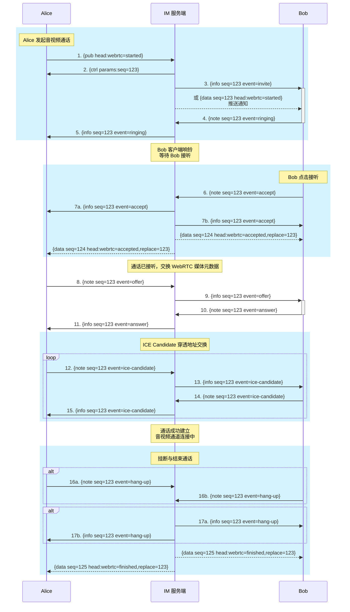
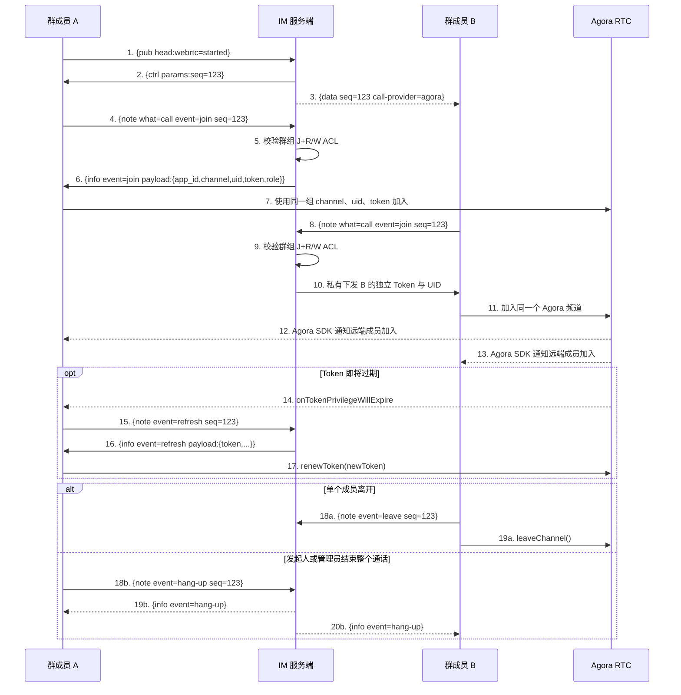

# 音视频通话建立流程设计规范

本文包含两条通话路径：

- P2P Topic 使用 [WebRTC](https://webrtc.org/) 和 IM 信令交换 SDP/ICE。
- 普通群组 Topic 使用 Agora RTC，IM 服务端负责 ACL、AccessToken2 和通话状态，媒体流不经过 IM 服务端。

## P2P WebRTC 建立流程

下图展示了用户 `Alice` 与 `Bob` 之间的 P2P 通话建立完整流程。该流程在概念上类似于 [SIP 协议](https://en.wikipedia.org/wiki/Session_Initiation_Protocol)，但在传输层原生使用了 IM 基础报文消息。

**说明**：
- 所有信令交互均由 IM 服务端转发与代理。
- 客户端发往服务端的事件均通过设置了通话 `topic` 与 `seq` 字段的 `{note}` 消息进行派发。
- 服务端发往客户端的数据通过在 `me` 主题上设置了 `src`（通话主题）与 `seq` 字段的 `{info}` 消息（和/或 Data 离线推送通知）进行路由。
- 假设 Alice 和 Bob 均可能多端同时在线（多设备登录）。

---

## 流程阶段划分

整个通话生命周期划分为 4 个核心阶段：
* **步骤 1 - 5**：通话发起 (Call Initiation)
* **步骤 6 - 7**：通话接听 (Call Acceptance)
* **步骤 8 - 15**：媒体与网络元数据协商 (Metadata & ICE Exchange)
* **步骤 16 - 17**：通话挂断/终止 (Call Termination)

---

## 详细步骤说明

### 1. 通话发起 (Call Initiation)
1. `Alice` 发布包含 `webrtc=started` Header 的消息，发起通话。
2. 服务端响应包含该通话 `seq` 编号的 `{ctrl}` 消息。
3. 服务端向 `Bob` 的所有设备路由 `invite` 邀请事件。
   - 同时，服务端向 `Bob` 发送包含 `webrtc=started` 的离线 Push 推送通知。
   - `Bob` 的设备收到后弹出来电响铃 UI 界面。
4. `Bob` 的客户端响应 `ringing` 响铃事件。
5. 服务端将 `ringing` 事件转发给 `Alice`，`Alice` 客户端播放去电等待响铃声。
   - 注意：由于 `Bob` 可能有多个多端在线设备分别确认邀请，`Alice` 可能会收到多次 `ringing` 事件。
   - 若在服务端设定的超时时间内 `Bob` 未接听，通话将自动超时挂断。
   - 至此，通话正式进入**已发起**状态。

### 2. 通话接听 (Call Acceptance)
6. `Bob` 点击接听，发送 `accept` 事件。
7. (a) 和 (b)：服务端向 `Alice` 和 `Bob` 广播 `accept` 接听事件。
   - 此外，服务端广播带 `webrtc=accepted` Header 的替换数据消息。
   - `Bob` 其他未接听的设备收到通知后自动静默消除来电界面。
   - 至此，通话正式进入**已接听**状态。

### 3. 元数据与 SDP 协商 (Metadata Exchange)
8. `Alice` 发送包含 SDP Offer 负载的 `offer` 事件。
9. 服务端将 `offer` 转发给 `Bob`。
10. `Bob` 收到 `offer` 后，回应包含 SDP Answer 负载的 `answer` 事件。
11. 服务端将 `Bob` 的 `answer` 事件转发给 `Alice`。
12-15. `Alice` 与 `Bob` 之间双向交换 ICE Candidate 网络穿透 Candidate 数据。

### 4. 通话挂断 (Call Termination)
16. 任何一方点击挂断，发送 `hang-up` 事件。
17. 服务端转发 `hang-up` 事件并广播带有 `webrtc=finished` Header 的结束消息。

---

## Agora 群组通话建立流程

群组通话不交换 SDP Offer、SDP Answer 或 ICE Candidate。每个客户端先从 IM 服务端获取仅对当前频道和当前 Session UID 有效的短期 Token，再直接连接 Agora RTC。

### 群组通话权限

- 只有群组可写成员可以发布通话邀请。
- 具有 `J+R` 权限的普通成员可以请求加入。
- 可写成员获得 `publisher` Token，可以发布音频、视频和数据流。
- 只读成员获得 `subscriber` Token，只包含加入频道权限。
- 发起人和群管理员可以结束整个通话，普通成员只能离开自己的 Session。
- 服务端为同一账号的不同 Session 生成不同 Agora UID，支持多端同时加入。

### Token 与状态生命周期

- App Certificate 只保存在 IM 服务端，用于 HMAC-SHA256 签发 AccessToken2。
- Token 绑定服务端生成的频道名和数字 UID，不使用通配频道或通配用户。
- Token 默认有效 3600 秒，配置范围为 60–86400 秒。
- 客户端收到 Agora SDK 的 Token 即将过期回调后，通过 `refresh` 获取新 Token，并调用 `renewToken`。
- Session 异常断开时，IM 服务端移除对应参与状态；最后一个参与者离开时结束通话。
- 接通、结束、未接和异常断开继续使用替换型消息持久化，历史消息中不保存 Token。

完整报文和配置参见 [`API.md`](./API.md#音视频通话-video-calls)。当前服务端和协议已经实现；正式客户端仍需集成 Agora RTC SDK，并使用真实 Agora 项目完成跨端联调。
