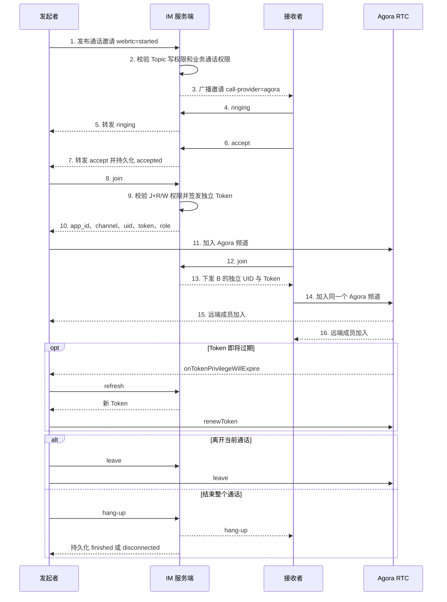

# Agora 音视频通话建立流程

> 完整报文见：[服务端协议参考](API.md#音视频通话-video-calls)

一对一语音、一对一视频、群组语音和群组视频统一使用 Agora RTC。IM 服务端只负责
邀请、权限、通话状态和短期 Token；音视频媒体不经过 IM 服务端，也不通过业务
WebSocket 交换 SDP 或 ICE Candidate。

消息头中的 `webrtc` 是既有的通话状态字段名称，不代表媒体使用 WebRTC。服务端会
同时写入 `call-provider: agora`，客户端只能按 Agora 流程加入。

## 建立流程



## 权限规则

- 发起通话需要 Topic 写权限，并通过商城业务策略的 `call` 能力检查。
- 加入和续期需要有效的 `J+R` 权限；可写成员获得 `publisher`，只读成员获得
  `subscriber`。
- 一对一通话任一合法参与者都可以挂断。
- 群组通话由发起人或群管理员结束；普通成员可以离开后再次加入仍在进行的通话。
- 每个 Session 获得独立 Agora UID 和 Token，同一账号多设备互不复用凭据。
- Token 不广播，只返回给通过最新 ACL 校验的请求 Session。

## 服务端配置

```yaml
calls:
  enabled: true
  app_id: ""
  app_certificate: ""
```

可选参数：

- `call_establishment_timeout`：未接听自动结束秒数，默认 30。
- `token_ttl`：Agora Token 有效秒数，默认 3600。
- `channel_prefix`：服务端生成频道名的前缀，默认 `im`。
- `max_participants`：单次通话最大在线 Session 数，默认 128。

不再需要 `ice_servers`、`STUN` 或 `TURN` 配置。
