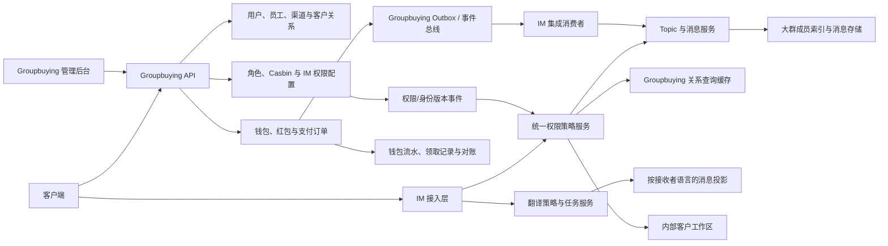
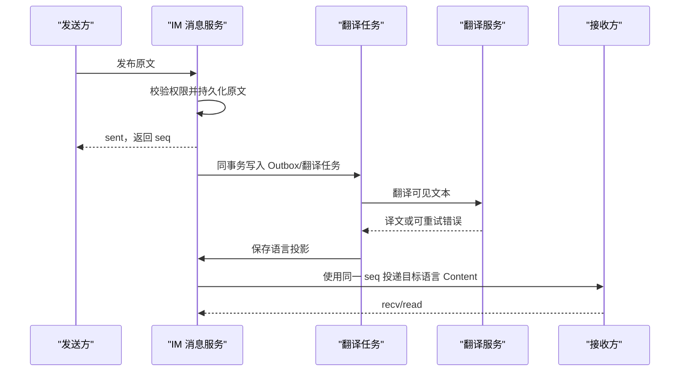

# IM 产品统一功能需求与服务端设计

> 文档信息
>
> - 日期：2026-07-30
> - 状态：统一需求基线；各功能实现状态见本文
> - 范围：消息、文件、音视频、群组/频道、联系人、通知、素材、客户协作、翻译、支付
>   的服务端需求、现状、模型、接口、安全边界、分期与验收
> - 不包含：正式客户端页面、支付机构签约、法务意见和生产容量承诺
> - 外部依赖：真实客户/员工身份、钱包、红包和支付能力以
>   `/Users/wildfire/pro/Groupbuying/server` 为业务事实来源
> - 文档定位：本文是全部产品功能需求的唯一主文档；其它 API、规划和专题文档只作为
>   实现参考，不再分别承载产品需求

## 1. 结论

本文统一收录 15 个功能域。基础消息、文件、音视频、普通群、联系人、素材和推送已有
不同程度的服务端基础；本轮新增范围不能作为一个普通“群功能”一次性实现，应再拆成
以下七个独立但共享权限中心的服务端能力：

1. **官方只读频道**：只有平台分配的管理员或发布者可以发消息，普通订阅者服务端
   强制只读。
2. **官方大群**：产品层不设置固定人数上限，成员、在线状态和消息扇出按大规模模型
   重新实现；管理员由平台或机构管理员分配。
3. **客户归属隔离**：业务员只能主动私聊自己负责或明确共享给自己的客户；不能依赖
   客户端隐藏入口，必须拦截 P2P 创建、加入、发消息和呼叫。
4. **Groupbuying 红包/转账集成**：用户、钱包、红包订单、领取和资金流水由
   Groupbuying 负责；IM 只保存外部订单引用并展示不可伪造的支付卡片，不再建设第二套
   用户、钱包或账本。
5. **双向自动翻译**：业务员发送中文时客户只看到英文投影，客户发送英文时业务员
   默认看到中文投影；原文由服务端留存用于审计和纠错。
6. **内部客户资料**：备注、标签和业务字段只能由同机构的授权员工读取，绝不进入
   客户可见的用户资料、消息或推送。
7. **内部三级置顶**：分别支持置顶客户、置顶会话和置顶会话内的重点消息，全部为
   员工侧私有状态，不复用对会话双方可见的 Topic 共享置顶。

当前仓库与目标的差距如下：

| 能力 | 当前状态 | 结论 |
| --- | --- | --- |
| 普通群、广播频道和角色 ACL | 已有基础实现 | 复用 |
| 频道普通订阅者服务端只读 | 已实现 | 官方频道写入前强制刷新持久化角色 |
| 永久禁言、封禁和移除 | 已有基础实现 | 增加定时禁言、原因和审计 |
| 独立权限与基础配置后台 | 已实现第一版 | Svelte 管理端 + 本地 Casbin + 版本化配置与审计 |
| 平台创建官方频道 | 已实现 | 独立管理 API 创建、认证并分配管理员/发布者 |
| 平台创建官方大群 | 已实现服务端闭环 | 管理 API 创建、平台分配管理员、治理与审计已落地 |
| 普通成员无限规模可写大群 | 已实现冷成员基础模型 | 无产品固定上限；生产容量和批量 Push 验收尚未完成 |
| 按客户归属限制私聊 | 未实现 | 新增客户归属模型和统一策略检查 |
| Groupbuying 红包/转账接入 | 两仓均有基础，但未集成 | Groupbuying 管资金，IM 管消息投影 |
| 中英双向消息翻译 | 未实现 | 新增翻译策略、异步任务和按接收者内容投影 |
| 联系人个人私有别名 | 已有基础实现 | 不能替代机构级客户备注和结构化资料 |
| Topic 共享消息置顶 | 已实现 | 保留；另建客户、会话、消息三级内部置顶 |

这里的“人数不设上限”定义为：**不设置产品套餐上的固定成员上限**，而不是宣称计算机
资源无限。服务端仍必须保留容量保护、速率限制、分片阈值和紧急熔断，否则单个群就能
拖垮整个集群。

### 1.1 状态图例

- ✅ **已实现**：仓库已有服务端代码和协议闭环。
- 🟡 **部分实现**：基础流程存在，但生产规模、跨节点可靠性、管理能力或客户端尚未闭环。
- ❌ **未实现**：当前只有需求或设计，没有可用代码。

状态描述以当前仓库为准，不把设计文档当成已经交付。

### 1.2 全部功能需求总表

| 编号 | 功能域 | 统一需求 | 当前状态 |
| --- | --- | --- | --- |
| FR-01 | 多媒体消息 | 文本、表情、图片、视频、语音、文件消息；发送/送达/已读；编辑、撤回、回复、转发、反应、公开置顶和定时发送 | ✅ 服务端基础闭环 |
| FR-02 | 文件分享与预览 | 文档、图片、音视频跨平台传输；断点续传、在线预览、压缩/转码、安全扫描和文件级 ACL | ✅ 服务端基础闭环；可靠任务与跨节点续传已实现 |
| FR-03 | 实时音视频 | P2P 与多人音视频通话；低延迟、短期 Token、角色控制、断线清理和质量监控 | 🟡 服务端基础实现，正式客户端和生产联调未完成 |
| FR-04 | 普通群组管理 | 创建群、邀请成员、所有者/管理员/成员、禁言、移出、封禁、群消息管理 | ✅ 基础权限闭环；高级治理部分缺失 |
| FR-05 | 官方只读频道 | 平台创建与认证；平台分配管理员/发布者；普通订阅者绝对只读 | ✅ 服务端闭环 |
| FR-06 | 官方大群 | 不设置产品固定人数上限；平台分配管理员；全员/单人禁言、移出、封禁和审计 | 🟡 服务端闭环；生产容量与批量 Push 验收待完成 |
| FR-07 | 联系人与好友 | 联系人 CRUD、分组、好友申请/接受/删除、共同好友推荐和多设备同步 | 🟡 基础协议已实现，正式数据表和跨节点事务未完成 |
| FR-08 | 客户归属隔离 | 业务员只能私聊自己的独占/共享客户，不能联系其他业务员客户 | ❌ IM 未接入 Groupbuying 关系数据 |
| FR-09 | 内部客户工作区 | 客户备注、结构化资料、标签、优先级和个人/团队/机构可见范围，客户不可见 | ❌ 未实现 |
| FR-10 | 双向自动翻译 | 中文业务员消息对客户显示英文；英文客户消息对业务员显示中文 | 🟡 服务端首期 |
| FR-11 | 内部三级置顶 | 置顶客户、置顶会话、置顶会话内重点消息；仅员工可见并多设备同步 | 🟡 私有 MVP 已实现；待接客户归属 |
| FR-12 | 素材消息 | 贴纸、动态 Emoji、GIF 素材包、关键词查询、消息引用和内容治理 | 🟡 服务端目录已实现，用户生态和外部 GIF 搜索未完成 |
| FR-13 | 通知推送 | 新消息和互动及时通知；全局/会话静音、仅提及、免打扰、预览设置和可靠重试 | 🟡 推送入口已有，通知偏好和可靠队列未完成 |
| FR-14 | 红包与转账 | 业务员使用 Groupbuying 资金能力向自己的客户发送红包/转账；IM 展示状态卡片 | 🟡 Groupbuying 有钱包和营销红包，聊天订单契约未实现 |
| FR-15 | 群红包 | 固定/随机金额、领取范围、并发防超发、过期关闭和剩余资金释放 | 🟡 Groupbuying 有活动红包，尚未达到聊天群红包一致性要求 |

### 1.3 FR-01 多媒体消息

服务端需求：

- 支持纯文本、Drafty 富文本、普通 Emoji、图片、视频、语音、音频和通用文件。
- 支持服务端可信的 `sent/delivered/read` 状态，多设备状态一致。
- 支持编辑、撤回、回复、转发、相册、反应、公开消息置顶和定时发送。
- 同一客户端幂等键重试不得重复保存、重复广播或重复增加未读。
- 消息编辑、撤回和附件生命周期必须保持一致；无权用户不能绕过客户端直接操作。
- 贴纸、动态 Emoji 和 GIF 的详细需求归入 FR-12。
- 自动翻译是接收者内容投影，不改变原始消息及其 `topic + seq`，详细需求归入 FR-10。

验收：

- 断网重试、多设备登录和集群 Owner 切换不产生重复消息。
- 送达/已读回执持久化后才确认成功。
- 编辑、撤回、反应和公开置顶在离线同步后保持一致。

### 1.4 FR-02 文件分享、压缩与在线预览

服务端需求：

- 支持文档、图片、视频、语音、音频和其它允许类型的跨平台上传、下载和消息引用。
- 服务端计算文件摘要，不信任客户端声明；文件发布前校验所有者和安全状态。
- 支持分块/断点续传、偏移校验、最终摘要校验和失败恢复。
- 上传会话、分块清单和节点租约持久化；分块写入共享媒体存储，任意节点均可继续上传。
- 文档转换为安全 PDF 预览；图片生成缩略图；视频生成海报和压缩版本；音频生成通用压缩格式。
- 原文件和所有派生预览继承相同 Topic/用户 ACL。
- 恶意文件进入隔离区，扫描未完成、失败或命中时禁止发布和下载。
- 后台任务使用持久队列、原子 Worker 租约、过期恢复、指数退避、死信、人工重试和
  expvar 处理指标。

验收：

- 中断上传后可以从服务端确认的偏移继续，错误偏移不会破坏文件。
- 上传请求切换到另一节点或原节点重启后，仍能从数据库记录的偏移继续；并发 PATCH
  只能有一个节点持有写租约。
- 处理 Worker 重启后可恢复排队或租约过期任务；临时错误自动退避，超过次数进入死信。
- 无 Topic Read 权限的用户无法下载原文件或预签名 URL。
- 转码失败不影响原始订单/消息状态，能够重试并形成审计。
- 消息硬删除、附件替换和 Topic 删除会正确回收文件 ACL 和引用。

### 1.5 FR-03 实时音视频通话

服务端需求：

- 支持 P2P 和多人音视频通话的创建、邀请、响铃、接听、拒绝、离开和结束。
- P2P 使用 WebRTC 信令并配置生产 TURN；多人通话使用受支持的 RTC 服务。
- Token 必须短期有效并绑定用户、通话、角色和设备 Session。
- 只有有权成员可以加入，群组只读成员默认只能订阅媒体，不能发布音视频。
- 支持断线清理、Token 续期、通话状态持久化、并发通话限制和滥用控制。
- 建立端到端延迟、丢包、抖动、首帧、卡顿和通话失败监控。

当前边界：

- P2P WebRTC 信令和 Agora 群通话服务端已有基础实现。
- 正式 Web/移动客户端、真实 Agora 项目联调、TURN 生产验证、屏幕共享、录制、
  Voice Chat 和频道直播尚未完成。

### 1.6 FR-04 至 FR-06 群组、官方频道和官方大群

统一要求：

- 普通群支持创建、邀请、成员分页、所有权转移、管理员、普通成员和只读成员。
- 禁言、移出和封禁必须是不同动作；支持永久/定时禁言、全员禁言、原因和审计。
- 官方只读频道只有平台分配的所有者、管理员或发布者能发消息，普通订阅者在服务端
  无法通过发布、编辑、定时消息、置顶、删除或通话旁路发言。
- 官方频道和官方大群只能由平台或被授权的机构所有者创建、认证和分配管理员。
- 官方大群 `member_limit=0` 只表示无产品固定上限，仍执行分片、速率、在线 Session、
  推送积压和热点保护。
- 大群成员列表分页，完整成员不常驻单个 Topic Actor；离线成员通过历史水位拉取。

详细角色、管理接口和大群容量模型见本文第 5 节。

### 1.7 FR-07 至 FR-09 联系人、客户隔离和内部客户资料

联系人要求：

- 联系人添加、修改、删除和分组管理。
- 好友申请、接受、删除、拉黑和反骚扰。
- 共同好友等可解释推荐，服从隐私设置和曝光去重。
- 多设备使用版本号增量同步，跨节点并发使用数据库事务或 CAS。

客户业务要求：

- 建立机构、团队、业务员、客户和独占/共享/临时分配模型。
- P2P 创建、恢复、发布、呼叫和支付均检查客户归属。
- 客户转移后旧业务员立即失去新消息、呼叫和付款权限，历史是否可见由机构策略决定。
- 客户备注、标签、语言、来源、优先级和自定义字段只进入内部客户工作区。
- 内部资料支持 `private/team/org` 可见范围、加密、版本、审计和多设备同步。
- 客户本人、其它机构和未获分配的业务员不能读取内部资料是否存在。

详细策略见本文第 6、7 节。

### 1.8 FR-10 双向自动翻译

当前已实现 P2P 纯文本的服务端首期：五类可配置供应商、按语言路由、自动故障转移、
超时/额度/熔断、异步接收方投影、历史与搜索投影、Push 原文隔离、持久翻译缓存和
URL/代码/金额/账号占位保护。客户归属身份接入、机构词库版本、持久重试任务及
“翻译完成后 delivered”客户端联调仍待完成，配置方法见
[automatic-translation.md](automatic-translation.md)。

- 业务员发送中文时保存中文原文，英语客户只接收英文投影。
- 英语客户发送英文时保存英文原文，业务员默认接收中文投影。
- 原文不可被覆盖；译文绑定消息版本、目标语言、受众和机构词库版本。
- 翻译完成并到达目标设备后才计为 `delivered`。
- 实时广播、历史、离线同步、搜索、回复预览、转发预览和 Push 使用同一查看者投影。
- 翻译失败默认等待和重试，不能擅自把中文内部原稿发给客户。
- URL、代码、金额、账号、提及和文件实体使用占位符保护；数值或占位符异常转人工。
- 首期只支持员工与客户的中英 P2P；频道可预生成少量语言，大群不逐成员热路径翻译。

详细模型和流程见本文第 7 节。

### 1.9 FR-11 内部三级置顶

- **置顶客户**：客户列表优先展示需要跟进的客户。
- **置顶会话**：聊天列表置顶指定客户会话；本文把“置顶聊天记录”定义为置顶会话。
- **置顶消息**：在某个会话中标记重点消息并快速跳转。
- 三类置顶默认属于当前业务员，可选团队共享，客户永远不可见。
- 置顶数据服务端持久化、稳定排序并多设备增量同步。
- 客户转移后旧业务员置顶失效；消息撤回后只显示“已撤回”占位。
- 现有 `{note what:"pin"}` 是对会话双方/全群公开的 Topic 共享置顶，不能承载内部置顶。

### 1.10 FR-12 贴纸、动态 Emoji 和 GIF

- 由平台管理素材包、素材类型、关键词、版本、发布和下架状态。
- 消息只能引用已发布的服务端素材 ID，不能用任意外部 URL 冒充。
- 消息不保存图片或动画 URL；目录保存 URL、SHA-256、大小、revision 和多规格变体，
  客户端按“内置小包 → 本地缓存 → 服务端批量解析 → CDN”加载。
- 已发布素材 ID 的内容身份不可变；换图必须创建新 ID，删除采用软下架，避免历史
  消息因同 ID 换图而变义。
- 支持贴纸、透明动态 Emoji 和 GIF 的格式、尺寸、帧率、时长和大小校验。
- 支持用户安装/卸载、收藏、最近使用、个人排序和多设备同步。
- 支持创作者提交、版权归属、审核、举报、下架和申诉。
- 外部 GIF 搜索需要供应商适配、内容分级、缓存、热门排序和地区/年龄过滤。

当前已有 root 管理的素材目录、发布控制、本地关键词查询、最多 200 个 ID 的批量解析、
内容摘要、多规格变体、不可变内容约束、软下架和 Drafty `SK/AE/GF` 引用校验；客户端
素材面板/缓存、用户素材生态、文件本体规格检查和外部 GIF 搜索尚未实现。

### 1.11 FR-13 通知推送

- 新消息、提及、回复、反应、好友请求、客户转移、翻译失败和支付状态及时通知。
- 支持全局通知开关、单会话静音、仅提及、免打扰时段、声音、振动和内容预览。
- 内部通知与客户通知严格隔离；客户备注、内部置顶和中文内部原稿不能进入外部 Push。
- 通知偏好服务端持久化并多设备同步，不复用 Topic Presence ACL。
- 使用持久推送队列、幂等键、优先级、指数退避、死信和 Token 健康管理。
- 监控推送接受、送达、失败、延迟、重试和死信。

当前已有 FCM/TNPG 推送入口和失效 Token 清理；独立通知偏好、可靠队列、失败重试和
送达监控尚未完成。

### 1.12 FR-14 与 FR-15 红包和转账

- Groupbuying 是用户、钱包、红包、领取记录和资金流水的唯一事实来源。
- 只有 Groupbuying 判定具有预算、角色和客户权限的业务员可以创建聊天红包或转账。
- IM 不保存可变余额，不直接加减钱包，也不调用底层支付渠道；只保存 Groupbuying
  `order_id`、安全展示快照和状态版本。
- 单聊支持转账/红包卡片；群红包支持固定或随机份额、唯一领取、过期关闭和剩余释放。
- Groupbuying 负责订单状态机、金额计算、风控、幂等、回调、退款和账务一致性；IM
  通过可靠事件更新卡片。
- 聊天卡片只是投影，撤回或删除消息不能删除 Groupbuying 订单、领取记录或资金流水。

详细模型、状态机和安全边界见本文第 8、9 节。

## 2. 对现有实现的判断

### 2.1 可以直接复用的能力

现有频道已经区分管理成员和只读订阅者：

- `owner`、`admin`、`publisher` 可以管理或发布。
- `subscriber` 使用 `J+R+P` 权限，没有写权限。
- 频道读者存放在 `chn...` 命名空间，离线时不需要全部常驻 Topic 内存。
- 发布、编辑、定时发送、置顶和删除等入口均有服务端 ACL 校验。
- `readonly`、`banned` 和删除订阅已经分别覆盖基础禁言、封禁和移除。

对应实现：

- [`internal/server/topic_roles.go`](../internal/server/topic_roles.go)
- [`internal/server/topic_msg.go`](../internal/server/topic_msg.go)
- [`internal/server/topic_meta_delete.go`](../internal/server/topic_meta_delete.go)
- [`internal/server/topic_roles_test.go`](../internal/server/topic_roles_test.go)

因此，官方只读频道不需要重新发明消息路由；重点是新增“谁能创建官方对象、谁能分配
管理员、是否允许互动”的平台控制面和审计。

### 2.2 不能直接扩容成官方大群的部分

普通群成员当前受 `max_subscriber_count` 限制，生产配置示例分别为 128、1,000 或
10,000。普通群成员还会进入 Topic 的 `perUser` 状态，离线通知、未读更新和部分
Presence 处理也会遍历成员数据。

相关位置：

- [`configs/im.yaml`](../configs/im.yaml)
- [`internal/server/topic_sub_self.go`](../internal/server/topic_sub_self.go)
- [`internal/server/topic_sub_other.go`](../internal/server/topic_sub_other.go)
- [`internal/server/topic_roles.go`](../internal/server/topic_roles.go)
- [`internal/server/topic.go`](../internal/server/topic.go)

直接把人数上限改为很大的整数会带来内存、数据库写放大、Presence 风暴和推送风暴，
不能视为完成“大群不限人数”。

### 2.3 当前 P2P 缺少业务关系检查

客户端使用 `usr...` 目标时，服务端会展开为两个用户唯一的 `p2p...` Topic；
`initTopicP2P` 只检查双方用户是否存在及默认 ACL，没有“客户属于哪个业务员”的模型。

相关位置：

- [`internal/server/session_topic_ops.go`](../internal/server/session_topic_ops.go)
- [`internal/server/init_topic.go`](../internal/server/init_topic.go)

因此，仅在大群成员列表里隐藏“私聊”按钮无法满足隔离要求。知道用户 ID 的客户端仍可
直接构造协议请求，服务端必须在所有 P2P 路径上重复授权。

### 2.4 Groupbuying 已有红包基础，但不是聊天红包

IM 仓库没有资金能力；Groupbuying 仓库已经存在：

- `mall.User`、`system.SysUser` 两套真实客户/后台员工身份。
- `UserWallet`、`UserWalletDetail` 和佣金汇总/流水。
- `SysRedPacket`、`UserRedPacket`、代理红包额度配置。
- Redis 红包份额、RabbitMQ 异步领取入账、后台红包管理 API。
- 后台 `SysAuthority`、菜单/API 权限和 Casbin 管理界面。

这些能力可以作为集成基础，但当前 `SysRedPacket` 是营销活动红包，不是聊天内业务员
向指定客户付款。现状还包括金额使用 `float64`、领取份额先从 Redis 弹出再异步入账、
RabbitMQ 消费者在数据库更新失败后仍确认消息、领取记录缺少明确的数据库复合唯一约束、
没有聊天 `topic/seq`、客户端幂等键、订单状态版本和支付事件 Outbox。因此不能把现有
`POST /v1/red-packet` 直接当作聊天红包接口，也不能让 IM 根据该接口的即时返回金额
自行修改聊天卡片为“已到账”。

### 2.5 当前没有消息内容翻译

协议握手和设备记录中已有 `lang`，但它目前用于记录设备首选语言、选择验证码/邮件
模板和推送语言，不会翻译聊天正文。现有历史拉取和实时广播会把同一份 `Content`
直接返回所有有权限的会话，没有按接收者语言生成内容投影。

相关位置：

- [`internal/server/session_auth.go`](../internal/server/session_auth.go)
- [`internal/server/message_features.go`](../internal/server/message_features.go)
- [`internal/server/topic_meta_data.go`](../internal/server/topic_meta_data.go)

### 2.6 当前客户别名不足以承载内部客户资料

`AddressBookContact.Alias` 已经是当前用户私有的联系人别名，联系人只能在自己的 `me`
Topic 查询。但当前联系人状态按用户聚合存放在 PCache 中，没有机构、团队可见范围、
结构化客户字段、备注历史、字段级权限和管理审计。

相关位置：

- [`server/store/types/contact.go`](../server/store/types/contact.go)
- [`server/store/store_contacts.go`](../server/store/store_contacts.go)
- [`internal/server/topic_meta_contacts.go`](../internal/server/topic_meta_contacts.go)

个人别名可以保留用于员工自己的称呼，正式客户备注应使用独立 CRM 内部模型。

### 2.7 当前消息置顶是双方/全群共享状态

现有 `pinMessage` 把置顶消息序号保存在 `Topic.Aux["pins"]`，并向 Topic 的其它在线
会话广播变更。它适用于对会话参与者公开的置顶公告，但不适合客户不可见的员工重点记录。

相关位置：

- [`internal/server/message_interactions.go`](../internal/server/message_interactions.go)
- [`internal/server/message_features.go`](../internal/server/message_features.go)

客户、会话和消息的内部置顶必须使用单独的员工工作区表和内部 API，不能写入
`Topic.Aux["pins"]`。

## 3. 需求语义与默认规则

### 3.1 官方只读频道

- 当前独立管理 API 仅允许持有平台管理令牌的 `platform_root` 创建官方频道；
  `org_owner` 委派将在 Groupbuying 身份联调后开放。
- 默认成员角色为 `subscriber`，不能发消息、编辑、撤回、发起通话或发送输入状态。
- `owner`、`admin` 和 `publisher` 是否能发布由平台分配。
- 普通订阅者的反应、投票和评论默认关闭；以后可以逐项开启。
- 官方标识由服务端返回，客户端不能自行声明。
- 删除官方频道、转让所有权和取消官方认证属于高风险管理操作，需要二次确认和审计。

### 3.2 官方大群

- 官方大群允许普通成员发言，默认角色为 `member`。
- 管理员由平台或机构所有者分配，普通管理员不能继续任命同级管理员。
- `member_limit=0` 表示不设产品固定上限，但仍执行运行时容量保护。
- 支持全员禁言、单人永久/定时禁言、移出和封禁。
- 默认不广播精确在线名单和全量 Presence，只提供近似在线人数。
- 成员列表必须分页，不提供“一次获取全部成员”。

当前实现状态：

- `POST /v0/official-topics` 使用 `scale_class=large` 创建官方大群，
  `member_limit` 固定为 `0`，可在创建时由平台批量分配管理员。
- 全量成员关系继续使用数据库 `subscriptions(topic, userid)` 唯一索引；Topic Actor
  仅缓存所有者、管理员、在线与近期活跃成员，普通成员最后一个 Session 离开后释放快照。
- 成员加入和每次写入按短 TTL 刷新持久 ACL；跨节点移出、封禁和角色变更无需重启 Topic。
- `{get sub}` 使用 `cursor + limit` 稳定分页，JSON、WebSocket、Long Polling 和 gRPC
  Protobuf 均返回下一页 `next`，官方大群禁止无上限成员查询。
- 全员禁言写入官方 Topic 策略；单人禁言写入持久治理状态，每次消息、媒体、定时发送、
  编辑和 Agora 通话写路径都校验开始/过期时间。
- 管理 API 已区分 `mute/unmute/kick/ban/unban`，并记录操作者、请求 ID、原因、范围和时间。
- 尚未完成目标硬件的 1 万/10 万/更高成员容量报告，以及离线成员批量 Push 任务，因此
  FR-06 仍标记为 🟡，不能把“无产品固定上限”解读为已证明资源无限。

### 3.3 “自己的客户”私聊规则

本文按以下业务语义设计：

> 业务员可以主动私聊分配给自己的客户；在同一个官方大群中，不得主动私聊其他业务员
> 独占负责的客户。客户之间默认也不能通过大群相互发起私聊。

如果业务允许团队共享客户，必须创建显式的共享分配，不能通过“双方在同一个群”自动
放开。

建议默认矩阵：

| 发起方 | 目标 | 默认结果 | 条件 |
| --- | --- | --- | --- |
| 业务员 | 自己负责的客户 | 允许 | 有效独占或共享分配 |
| 业务员 | 其他业务员负责的客户 | 拒绝 | 经理临时授权除外 |
| 业务员 | 未分配客户 | 拒绝 | 先走领取/分配流程 |
| 客户 | 自己的业务员 | 允许 | 分配仍有效 |
| 客户 | 其他客户 | 拒绝 | 除非另有明确产品规则 |
| 经理/平台管理员 | 组织内客户 | 受控允许 | 必须记录管理原因 |
| 普通用户 | 已有好友/联系人 | 按原有策略 | 不得绕过客户隔离 |

该策略首先约束“从大群发现对方后发起私聊”，但安全实现必须作用于全局 P2P 入口，
否则攻击者可以离开大群后再次构造同一请求。

### 3.4 红包与转账

推荐的首期业务定义是：

- Groupbuying 持有真实用户、钱包、佣金和红包数据，IM 不复制这些领域模型。
- 业务员使用哪一种 Groupbuying 资金账户、红包领取后进入用户余额还是佣金余额，必须
  由 Groupbuying 产品规则明确，IM 不自行选择。
- 单聊转账可以要求客户确认收款；聊天中的红包/转账只是 Groupbuying 订单卡片。
- 群红包后续实现，Groupbuying 负责份额分配和原子领取，IM 只校验当前 Topic 上下文
  并显示结果。
- 不开放任意 IM 用户之间的个人转账；所有资金资格以 Groupbuying 权威判断为准。

微信支付当前“商家转账”产品包含用户确认收款和授权免确认两类流程，并要求按实际场景
报备；部分场景支持红包样式。具体资格、场景、额度和交互应在上线前以
[微信支付商家转账产品文档](https://pay.wechatpay.cn/doc/v3/merchant/4012711988)
和实际商户合同为准。

## 4. 总体架构



关键边界：

- Groupbuying 负责真实用户、后台员工、渠道、角色、钱包、佣金、红包和资金流水。
- IM 负责 `usr...` 映射、会话、消息顺序、群 ACL 和支付卡片投影，不持有真实用户密码、
  手机号全量副本或可变余额。
- Groupbuying 管理后台继续作为人员与业务权限配置入口；IM 不再建设第二套用户后台。
- Casbin 负责“这个 Groupbuying 员工角色能否执行某类 IM 功能”；客户归属、红包额度、
  钱包状态和支付状态仍由 Groupbuying 领域服务判断。
- 支付结果通过 Groupbuying Outbox 事件幂等更新聊天卡片，不能让客户端、RabbitMQ
  临时消息或支付回调直接修改任意聊天数据。
- 两个服务禁止共享业务数据库表。跨系统使用版本化内部 API、服务身份和事件契约。

### 4.1 Groupbuying 身份接入

Groupbuying 当前存在两类主体，主键空间可能重叠，不能只传一个裸 `user_id`：

| 主体 | Groupbuying 模型 | IM 主体键 |
| --- | --- | --- |
| 前台客户/代理用户 | `mall.User.ID` | `gb:customer:{id}` |
| 后台员工/运营人员 | `system.SysUser.UUID/ID` | `gb:staff:{uuid}` |

建议在 Groupbuying 新增 `im_identity_binding`：

| 字段 | 说明 |
| --- | --- |
| `principal_type` | `customer/staff` |
| `principal_id` | Groupbuying 内部 ID；员工同时保留 UUID |
| `im_uid` | IM 生成的稳定 `usr...` |
| `channel_id` | 当前业务租户/渠道 |
| `identity_version` | 昵称、头像、状态等投影版本 |
| `permission_version` | 角色/权限版本 |
| `status` | `active/disabled/deleted` |
| `created_at`、`updated_at` | 审计时间 |

唯一键为 `(principal_type, principal_id)` 和 `im_uid`。手机号、邮箱、昵称和邀请码均不能
作为跨系统主键。

优先复用 IM 已有 REST 外部认证器：

1. 客户端先在 Groupbuying 登录。
2. 调用 Groupbuying `POST /internal/im/login-ticket` 换取单次、短时 IM Ticket。
3. 客户端使用 Ticket 登录 IM 的 `rest` 认证方式。
4. IM REST 认证器调用 Groupbuying `/internal/im/auth` 验证 Ticket。
5. 首次登录时 IM 创建影子账号，并通过 `/internal/im/link` 把 `im_uid` 回写
   `im_identity_binding`。
6. Groupbuying 返回最小公开资料和受限标签；密码、钱包、手机号、后台 Token 不进入 IM。

不要直接让 IM 长期接受 Groupbuying 当前通用 HS256 Token。现有 Token 同时承载后台和
前台字段，且没有专用 `aud=im` 与主体类型。短时 Ticket 应包含 `iss`、`aud=im`、`jti`、
主体类型、主体 ID、状态和版本，并只允许使用一次；服务间调用使用 mTLS 或独立服务凭据。

Groupbuying 用户停用、渠道变化、员工角色变化或删除时，通过可靠事件发送
`identity.changed`/`permission.changed`：

- IM 立即断开或限制相关 Session。
- 清除客户关系与 Casbin 决策缓存。
- 更新昵称、头像等非敏感投影。
- 账号删除只禁用映射并按保留政策匿名化，不破坏历史消息发送者引用。

### 4.2 独立 Svelte 权限后台与 Groupbuying 最终接入

第一阶段已经在 IM 侧提供独立的 Svelte 管理后台和管理 API，不依赖 Groupbuying 即可
配置权限目录、角色模板、主体绑定、基础产品策略和审计记录：

- 管理端：`/Users/wildfire/github/im/im/web-admin`
- 服务端入口：`/v0/*`
- 权限执行：本地 Casbin，支持 `subject + domain + object + action`
- 配置存储：IM 持久缓存中的单一版本化文档，写操作必须携带 `If-Match`
- 临时身份：独立 Bootstrap 管理令牌，只保存在浏览器 Session Storage
- 集群约束：Groupbuying 接入前，管理写 API 只在一个受控节点启用

第一版权限命名空间为：

```text
subject = role:{role_id}
domain  = channel:{channel_id}
object  = im:asset | im:official_topic | im:customer | im:payment | ...
action  = read | create | edit | publish | assign | send | approve | ...
```

Groupbuying 已有 `SysAuthority`、菜单/API 管理和 Casbin `casbin_rule`。但当前模型只按
`AuthorityId + HTTP path + method` 判断，没有 `channel_id/org_id` Domain，Matcher
也没有使用角色继承 `g`。因此两个系统联调放到最后，届时：

- 保留现有 Svelte 管理端、权限键和管理 API 契约。
- 把 Bootstrap 管理令牌替换为 Groupbuying 短时员工身份。
- 把本地角色/绑定 Repository 替换为 Groupbuying 策略快照或事件同步 Provider。
- 将 `gb:staff:{uuid}` 绑定到现有角色和渠道 Domain。
- 红包额度、客户归属和资金审批仍由 Groupbuying 领域服务权威判断。

不建议 IM 每发一条消息都同步调用 Groupbuying/Casbin。Groupbuying 是策略管理事实来源，
通过版本化策略快照或事件把角色—权限映射同步到 IM，本地 Casbin/缓存执行低延迟判断。
群内发言、只读、禁言和移出仍使用 IM 现有 Topic ACL；Casbin 管理跨 Topic 的后台和
业务功能权限，二者不重复。

## 5. 官方频道和官方大群

### 5.1 Topic 扩展字段

控制面把官方属性作为一等字段管理；聊天运行时在 Topic 的客户端不可见 `Aux` 保留键中
保存受保护的策略投影，以兼容现有数据库适配器：

| 字段 | 含义 |
| --- | --- |
| `org_id` | 所属机构/业务租户 |
| `official` | 是否由平台认证 |
| `official_status` | `pending/verified/suspended/revoked` |
| `scale_class` | `normal/large` |
| `member_limit` | `0` 表示无产品固定上限 |
| `join_policy` | `open/invite/approval/closed` |
| `admin_assign_policy` | `platform/org_owner` |
| `dm_policy` | `open/contact/customer_assignment/disabled` |
| `all_muted` | 是否全员禁言 |
| `reactions_enabled` | 只读频道是否允许反应 |
| `created_by` | 实际执行创建的管理员 |

兼容现有模型：

- `isChan=true + official=true`：官方只读频道。
- `isChan=false + official=true + scale_class=large`：官方大群。
- 保留现有 `grp...`/`chn...` Topic 命名，不引入第三套客户端 Topic 名称。

### 5.2 管理角色

| 角色 | 主要权限 |
| --- | --- |
| `platform_root` | 创建/撤销官方对象，分配机构所有者，紧急冻结 |
| `org_owner` | 管理本机构官方对象，分配 Topic 管理员和发布者 |
| `owner` | Topic 所有权，受官方控制面约束 |
| `admin` | 成员管理、禁言、移出、封禁、内容管理 |
| `moderator` | 禁言、移出、内容管理，不能调整管理员 |
| `publisher` | 仅频道发布内容 |
| `member` | 大群普通读写成员 |
| `subscriber` | 频道普通只读订阅者 |
| `readonly` | 被禁言的大群成员 |
| `banned` | 禁止加入 |

现有 `owner/admin/publisher/member/subscriber/readonly/banned` ACL 继续使用。
`platform_root`、`org_owner` 和 `moderator` 属于控制面角色，其中 `moderator` 可映射为
受限管理员能力集合，而不是直接获得完整 `ModeCFull`。
控制面角色由 Groupbuying `SysAuthority` 和 IM 权限映射产生；Topic 局部角色仍存储在
IM Subscription ACL 中。后台角色变化不能直接覆盖 Topic owner，必须调用受审计的
IM 管理接口完成委派。

所有角色变更都必须校验：

1. 操作者属于同一 `org_id` 或具有平台权限。
2. 操作者能授予的权限不超过自身委派范围。
3. 普通管理员不能创建、认证或删除官方对象。
4. 管理员不能修改同级或更高角色，除非策略明确允许。
5. 变更写入审计日志后才返回成功。

### 5.3 管理接口

服务端已提供独立管理 API，不允许普通聊天协议伪造官方属性：

| 接口 | 用途 |
| --- | --- |
| `GET /v0/official-topics` | 列出官方频道 |
| `POST /v0/official-topics` | 创建并认证官方只读频道 |
| `PATCH /v0/official-topics/{topic}` | 修改官方策略 |
| `PUT /v0/official-topics/{topic}/members/{uid}/role` | 分配管理员、发布者或订阅者角色 |
| `GET /v0/official-topics/{topic}/audit` | 查询官方频道管理审计 |
| `POST /v0/official-topics/{topic}/moderation/mutes` | 单人或批量禁言 |
| `DELETE /v0/official-topics/{topic}/moderation/mutes/{uid}` | 解除禁言 |
| `DELETE /v0/official-topics/{topic}/members/{uid}` | 移出成员 |
| `POST /v0/official-topics/{topic}/bans` | 封禁并阻止重新加入 |
| `DELETE /v0/official-topics/{topic}/bans/{uid}` | 解除封禁 |

普通成员邀请、离开和读取仍可复用现有 Topic 协议。

### 5.4 禁言、移出和封禁

必须明确区分三种动作：

| 动作 | 存储结果 | 能否重新加入 |
| --- | --- | --- |
| 禁言 | 保留成员关系，写权限临时失效 | 不涉及 |
| 移出 `kick` | 删除成员关系 | 按入群策略决定 |
| 封禁 `ban` | 保留持久封禁记录 | 不能，直到解封 |

新增 `topic_moderation_action`：

- `topic_id`
- `target_uid`
- `action`: `mute/unmute/kick/ban/unban`
- `scope`: `message/media/call/all`
- `reason_code` 与管理备注
- `starts_at`、`expires_at`
- `operator_uid`、`operator_role`
- `request_id`
- `created_at`

定时禁言不能只依赖延迟任务。每次写入都检查 `expires_at`，后台任务只负责及时恢复角色
和通知。这样即使任务队列延迟，权限判断仍然正确。

全员禁言按 Topic 策略判断：

```text
can_publish =
  topic is active
  AND member is joined
  AND member role has write
  AND (all_muted is false OR role is admin/publisher/owner)
  AND no active member mute for this message scope
```

### 5.5 大群容量模型

官方大群要支持普通成员发言，不能完全复用只读频道的 `chn...` 订阅方式。服务端已经
实现“冷成员”模型；其中批量 Push、分段未读聚合和目标硬件容量报告仍是生产验收项：

- Topic Actor 只保存当前连接、管理员、近期活跃成员和小型权限缓存。
- 完整成员关系存放在可分片的成员索引中，以 `(topic_id, user_id)` 唯一。
- 用户进入或发言时按需加载成员 ACL，并用短 TTL 缓存；角色变化通过版本号失效缓存。
- 只向当前在线 Session 实时扇出，离线成员上线后按序号拉取历史。
- Push 应通过批处理/广播任务生成，不在 Topic Actor 内同步遍历全部成员；当前批量任务
  尚未完成，不能把同步逐成员 Push 用于生产大群。
- 精确 Presence 默认关闭，只保留近似在线数和管理员可见的抽样指标。
- 未读计数应采用延迟水位或分段聚合，避免每条消息更新全部成员记录；该项仍待专项实现。
- 成员列表使用稳定游标分页，禁止无上限查询。
- 热门大群按 Topic 单写者保证消息序号，读取、推送和媒体分发横向扩展。

容量保护至少包括：

- 单群每秒发布、加入、角色修改和查询上限。
- 单用户、单设备、单 IP 限流。
- 每批推送最大数量和队列积压熔断。
- 单 Topic 最大在线 Session 保护阈值。
- 数据库分区/分片阈值和热点告警。
- 管理员紧急全员禁言和冻结 Topic 的开关。

上线前必须用目标硬件分别验证 1 万、10 万和更高成员量级；文档中的“无产品上限”
不能替代容量报告。

## 6. 客户归属隔离

### 6.1 数据模型

以下业务对象应由 Groupbuying 持有或从其现有渠道、邀请/裂变关系演进，IM 只保存带
版本和短 TTL 的授权投影。不能在两个项目分别维护一份可写客户归属。

#### `organization_member`

- `org_id`
- `user_id`
- `role`: `owner/manager/agent/auditor`
- `status`

#### `customer_profile`

- `org_id`
- `customer_uid`
- `status`
- `privacy_level`

#### `customer_assignment`

- `org_id`
- `customer_uid`
- `agent_uid` 或 `team_id`
- `assignment_type`: `exclusive/shared/temporary`
- `status`: `active/suspended/ended`
- `valid_from`、`valid_until`
- `version`
- `assigned_by`

唯一约束必须保证同一机构内，一个客户在同一时间最多有一个有效 `exclusive` 归属；
共享成员单独记录。

#### `direct_chat_authorization`

用于经理临时放行、客服协作和争议处理。建议由 Groupbuying 后台创建，并通过事件同步
到 IM：

- `org_id`
- `actor_uid`
- `target_uid`
- `reason`
- `valid_until`
- `approved_by`

### 6.2 统一授权函数

IM 所有入口调用同一个策略适配器；适配器优先读取 Groupbuying 关系版本的本地投影，
缓存缺失或版本过期时查询 Groupbuying 内部授权 API：

```text
CanDirectInteract(actor, target, capability, context)
```

`capability` 至少包括：

- `create_p2p`
- `join_p2p`
- `send_message`
- `send_media`
- `start_call`
- `send_payment`

必须落在以下位置：

1. 将 `usr...` 展开成 `p2p...` 之前做快速拒绝。
2. `initTopicP2P` 创建或恢复双方订阅前做权威检查。
3. 已有 P2P Topic 每次发布消息或发起呼叫前再次检查。
4. 红包/转账订单创建前检查 `send_payment`。
5. 管理员代用户操作时检查真实操作者和被代理用户两层权限。

入口检查用于尽早失败，持久化前检查用于防止客户刚转移时的竞态。拒绝统一返回业务码，
不要暴露“客户具体属于哪个业务员”。

Groupbuying 权威响应至少返回：

```json
{
  "allowed": true,
  "relationship_version": 42,
  "channel_id": 7,
  "reason_code": "assigned_customer",
  "valid_until": "2026-07-30T12:00:00Z"
}
```

IM 写入前携带 `relationship_version` 二次确认；Groupbuying 不可用且本地没有仍在有效期
内的肯定授权时默认拒绝创建新 P2P、发起支付和联系客户，不能为了可用性越权放行。

建议错误：

- `403 customer_relationship_required`
- `403 customer_assigned_to_other_agent`
- `403 direct_chat_disabled`
- `409 customer_assignment_changed`

### 6.3 客户转移

客户从业务员 A 转给 B 时：

1. Groupbuying 在一个事务中结束 A 的分配并创建 B 的分配，递增 `version`。
2. Groupbuying Outbox 发布权限失效事件，IM 清除 P2P、Casbin 和支付策略缓存。
3. A 与客户的历史聊天默认保留可读，以满足业务追溯。
4. A 的新消息、呼叫和付款立即冻结。
5. B 获得权限后可以进入该客户会话；是否允许看到 A 的历史由机构隐私策略决定。
6. 所有转移和管理例外写入审计。

若业务要求不同业务员不能共享同一个 P2P 历史，需要在 P2P 之上增加“业务会话实例”
概念，而不能继续只使用两个用户唯一的 `p2p...` Topic。

### 6.4 隐私和反绕过

- 客户端隐藏私聊按钮只是体验优化，不是权限控制。
- 大群成员列表不向普通业务员返回客户手机号、邮箱、真实外部账号或归属人。
- 对用户 ID 查询、成员分页和失败响应做速率限制，避免批量枚举客户。
- 被拒绝的私聊尝试进入安全审计，但不能通知无关业务员客户的具体归属。
- 群内转发、名片分享、@ 提及和支付卡片都不得携带可绕过权限的敏感标识。

## 7. 双向翻译与内部客户工作区

### 7.1 服务端不可变规则

本节所有能力都由服务端控制。客户端只负责展示和提交操作，不决定数据可见范围。

1. 客户永远不能读取员工备注、内部标签、客户优先级、内部置顶、翻译供应商信息或
   中文内部原稿。
2. 原始消息不可被翻译结果覆盖；翻译是与原消息版本绑定的派生内容。
3. 同一条消息对不同接收者可以返回不同语言的 `Content`，但 `topic + seq`、发送者、
   时间、回复关系和已读状态保持一致。
4. 内部字段不能放进普通用户 `public`、Topic `public`、共享消息 `Head` 或
   `Topic.Aux`。
5. 所有内部查询必须同时校验登录用户、`org_id`、机构角色和客户归属。
6. 普通客户使用原始协议请求访问内部 API 时统一返回无权限，不能通过错误信息枚举
   内部资料是否存在。

### 7.2 双向翻译默认策略

首期只对业务员与客户的 P2P 会话开启：

| 消息方向 | 服务端保存的原文 | 接收方默认看到 | 原文可见性 |
| --- | --- | --- | --- |
| 业务员 → 英语客户 | 中文 | 英文翻译 | 业务员和授权内部审计可见，客户不可见 |
| 英语客户 → 业务员 | 英文 | 中文翻译 | 客户本人和授权员工可展开查看 |
| 业务员 → 中文客户 | 中文 | 中文原文 | 不调用翻译 |
| 非文本/贴纸/GIF/文件 | 原始实体 | 原始实体 | 不翻译附件本体 |

语言来源按以下优先级确定：

1. 客户内部资料中的 `preferred_language`。
2. 客户最近认证设备上报的 BCP 47 `lang`。
3. 消息文本语言检测结果。
4. 机构默认外部语言。

业务员工作语言由机构策略决定，默认 `zh-CN`。客户首期默认 `en`，但不能把所有客户
硬编码成英文。

范围边界：

- 翻译纯文本和 Drafty 中的可见文本。
- URL、邮箱、电话号码、代码块、文件名、素材 ID、@ 提及和支付金额不得送去翻译。
- Drafty 翻译必须重新计算文本区间；不能把原文长度变化后的旧 `fmt` 偏移直接复用。
- 图片 OCR、语音转文字、字幕和语音合成不在首期范围。
- 官方频道可预生成少量配置语言版本；超大群不能在发布热路径为每个成员逐人翻译。

### 7.3 翻译数据模型

#### `translation_policy`

| 字段 | 说明 |
| --- | --- |
| `org_id` | 机构 |
| `scope` | `p2p/channel/large_group` |
| `internal_language` | 员工默认工作语言 |
| `external_default_language` | 客户未设置语言时的默认值 |
| `outbound_enabled`、`inbound_enabled` | 双向开关 |
| `failure_policy` | `hold/retry/send_original`，默认 `hold` |
| `show_original_to_staff` | 员工是否可以展开客户原文 |
| `glossary_version` | 当前业务词库版本 |
| `provider_profile` | 翻译供应商配置引用，不保存密钥 |

#### `message_translation`

| 字段 | 说明 |
| --- | --- |
| `topic_id`、`seq_id` | 原消息 |
| `message_version` | 原消息编辑版本 |
| `source_language`、`target_language` | 源语言和目标语言 |
| `audience` | `external/internal/channel-language` |
| `translated_content` | 翻译后的安全 Content |
| `status` | `pending/processing/succeeded/failed/superseded` |
| `provider`、`provider_request_id` | 供应商与幂等请求 |
| `glossary_version` | 使用的业务词库 |
| `content_hash` | 原文和翻译参数摘要 |
| `quality_flags` | 低置信度、术语未命中等内部标志 |
| `created_at`、`updated_at` | 时间 |

唯一键建议为：

```text
(topic_id, seq_id, message_version, target_language, audience)
```

翻译内容不要写入原消息 `Head`。独立存储才能避免普通历史查询意外把内部原文或其它
语言版本返回客户。

#### `translation_job`

- 持久任务 ID 和幂等键。
- 原消息引用与版本。
- 源/目标语言。
- 重试次数、下次重试时间和最后错误。
- 租约所有者、租约过期时间。
- 数据脱敏策略和供应商路由。

任务队列必须支持重启恢复、指数退避、死信和人工重试，不能只放在进程内 Channel。

### 7.4 翻译与投递流程



状态语义：

- `sent`：原文已由服务端持久化。
- `delivered`：目标语言投影已经到达接收设备，而不是仅表示原文写库成功。
- `read`：接收方打开了该语言投影。
- `translation_pending`：仅发送方和内部员工可见，不算已送达客户。
- `translation_failed`：通知业务员处理；默认不把中文原文泄露给英语客户。

默认采用**持久化后异步翻译、外部投递前等待译文**。这样不会让慢翻译供应商阻塞 Topic
消息序号，也不会让客户先短暂看到中文再被替换。

建议目标：

- 普通短文本翻译 P95 小于 1.5 秒，超时进入后台重试。
- 短暂失败自动重试；超过阈值进入死信并通知业务员。
- 业务员可以修改原文并重试，或在有权限时明确选择发送原文。
- 同一内容摘要只能在同机构、同词库版本和同语言方向内复用，避免跨机构缓存泄漏。

### 7.5 按接收者生成消息投影

现有 `serverDataFromStored` 对所有人生成同一份 `Content`。应增加统一投影函数：

```text
ProjectMessageForViewer(message, viewer, session_language, organization_policy)
```

所有读取出口必须使用它：

- 实时在线广播。
- 历史消息拉取。
- 离线同步。
- 搜索结果和回复预览。
- Push 通知标题与正文。
- 转发预览和被引用消息摘要。

投影规则：

1. 发送者始终看到自己的原文和翻译状态。
2. 外部客户只获得面向其语言的译文，不获得原文、供应商、质量标记和内部编辑历史。
3. 内部员工默认看到中文；按机构权限可以展开客户英文原文。
4. 尚未生成译文时，外部历史查询不能退回原文，应返回 `translation_pending` 占位状态。
5. 客户关系已失效的旧业务员即使知道 `topic + seq`，也必须服从客户历史可见策略。

必须为 Push 单独生成投影，否则消息正文虽然翻译了，锁屏通知仍可能泄露中文原文或
内部备注。

### 7.6 编辑、撤回、搜索与回复

- 编辑原文时递增 `message_version`，旧译文立即标记 `superseded`，新译文成功前不向
  客户下发编辑后的原文。
- 撤回消息同时让所有语言投影不可见，但按审计保留期保留服务端记录。
- 回复继续引用原消息的 `seq`，引用摘要由查看者自己的语言投影生成。
- 内部搜索可以索引原文和员工中文译文；客户搜索只能索引其有权看到的语言投影。
- 重新翻译不创建新聊天消息序号，也不重复增加未读数。
- 业务词库变化默认只影响新消息；批量重译历史必须作为受控后台任务执行。

### 7.7 翻译隐私与质量控制

- 优先选择支持约定数据地域、禁用于模型训练、短期或零保留的企业翻译服务；高敏感
  业务可部署自托管模型。
- 调用外部翻译前移除无须翻译的电话号码、邮箱、URL、支付单号和证件号占位符，
  翻译后再安全回填。
- 机构词库保存产品名、人名、行业术语和禁止翻译词，并进行版本管理。
- 原文、译文、供应商请求 ID、词库版本和人工修订均写入审计。
- 低置信度、金额/数字不一致、占位符丢失或敏感词异常时拒绝自动投递并转人工处理。
- 翻译服务不可用时必须 fail closed；除非机构明确把 `failure_policy` 设置为
  `send_original`，否则不能擅自向客户发送原文。

服务端翻译需要读取消息明文，与端到端加密 Secret Chat 不兼容；将来若增加 E2EE，
必须明确关闭服务端翻译或改为受控客户端翻译。

### 7.8 内部客户资料与备注

现有联系人 `Alias` 继续作为员工个人称呼。新增机构级客户工作区：

#### `customer_internal_profile`

| 字段 | 说明 |
| --- | --- |
| `org_id`、`customer_uid` | 机构内客户唯一键 |
| `display_name_internal` | 员工侧备注名 |
| `preferred_language` | 客户收消息语言 |
| `tags` | 机构内部标签 |
| `priority` | 客户优先级 |
| `source`、`company`、`timezone` | 结构化业务字段 |
| `custom_fields` | 按机构字段定义校验后的加密值 |
| `version` | 并发更新和增量同步版本 |
| `updated_by`、`updated_at` | 修改审计 |

#### `customer_note`

- `note_id`
- `org_id`、`customer_uid`
- `author_uid`
- `visibility`: `private/team/org`
- `team_id`
- `content_ciphertext`
- `created_at`、`updated_at`、`deleted_at`
- `version`

建议区分“资料字段”和“跟进备注”：

- 资料字段保存当前事实，例如称呼、语言、来源和公司。
- 跟进备注采用追加记录，修改和删除保留审计版本，避免多人覆盖。

权限：

- `private` 只有作者可见。
- `team` 只有客户所属团队可见。
- `org` 由机构授权员工可见。
- 经理和审计员是否可以查看员工私有备注由机构合规策略决定，不能默认绕过。
- 客户本人、其它机构和无客户归属的业务员永远不可见。

内部资料不得写入 `TheCard`、联系人公开 `Public`、客户自己的 `me` Topic 或普通聊天
消息。API 响应应使用专门的内部 DTO，避免通用序列化器误带字段。

### 7.9 三级内部置顶

需要区分三种用户体验和三套数据：

| 置顶类型 | 作用范围 | 默认可见者 | 排序用途 |
| --- | --- | --- | --- |
| 客户置顶 | 客户列表 | 当前业务员 | 优先跟进客户 |
| 会话置顶 | 会话列表 | 当前业务员 | 会话排在普通聊天之前 |
| 消息置顶 | 某会话内重点记录 | 当前业务员 | 快速定位重要消息 |

可选增加 `team` 共享置顶，但必须由显式权限开启。客户永远不能看到这些状态。

#### `internal_pin`

| 字段 | 说明 |
| --- | --- |
| `org_id`、`owner_uid` | 机构与置顶所属员工 |
| `pin_type` | `customer/conversation/message` |
| `customer_uid` | 客户置顶目标 |
| `topic_id` | 会话或消息所在 Topic |
| `seq_id` | 消息置顶时必填 |
| `scope` | `private/team`，默认 `private` |
| `team_id` | 团队共享时必填 |
| `rank` | 手工排序值 |
| `pinned_at` | 相同 rank 的稳定排序 |
| `version` | 增量同步 |

唯一约束：

```text
private: (org_id, owner_uid, pin_type, target)
team:    (org_id, team_id, pin_type, target)
```

排序建议：

```text
pinned DESC, rank ASC, pinned_at DESC, last_activity_at DESC
```

删除客户关系、会话或消息时不一定物理删除置顶：

- 客户转移后，旧业务员的客户/会话置顶失效并从工作列表隐藏。
- 消息被撤回时，内部置顶保留“消息已撤回”的审计占位，不能展示原文。
- 客户重新分配回来时是否恢复旧置顶由机构策略决定，默认不自动恢复。

现有 Topic 共享置顶继续用于双方都能看到的公开置顶消息；内部消息置顶必须走
`internal_pin`，不得调用当前的 `{note what:"pin"}`。

### 7.10 内部 API 与多设备同步

建议接口：

| 接口 | 用途 |
| --- | --- |
| `GET /v0/internal/customers/{uid}` | 获取按员工权限裁剪的客户内部资料 |
| `PATCH /v0/internal/customers/{uid}` | 更新客户结构化资料 |
| `POST /v0/internal/customers/{uid}/notes` | 新增内部备注 |
| `PATCH /v0/internal/customers/{uid}/notes/{note}` | 修改本人有权编辑的备注 |
| `DELETE /v0/internal/customers/{uid}/notes/{note}` | 软删除备注 |
| `PUT /v0/internal/pins/{type}/{target}` | 置顶或调整顺序 |
| `DELETE /v0/internal/pins/{type}/{target}` | 取消置顶 |
| `GET /v0/internal/workspace?since={version}` | 增量同步资料、备注和置顶 |
| `POST /v0/internal/translations/{topic}/{seq}/retry` | 重试失败翻译 |

写入使用 `expected_version` 做乐观并发控制。变更通过员工自己的内部同步 Topic 或
可靠事件流发送到其它设备；不得向客户的 `me` Topic、P2P Topic 或外部 Push 发送
备注和置顶事件。

普通聊天协议继续返回客户可见消息。只有经过内部身份验证的员工客户端可以调用
`/v0/internal/`，网关还应校验客户端应用类型和设备策略。

## 8. 红包与转账

### 8.1 合规边界

真实货币资金转移应由银行或持牌支付机构完成。国务院
[《非银行支付机构监督管理条例》](https://xzfg.moj.gov.cn/law/download?LawID=1696&type=pdf)
将取得支付业务许可并根据电子支付指令转移货币资金作为受监管支付机构的业务，并要求
遵守反洗钱、反恐怖融资和反电信网络诈骗等规定。

因此，本项目默认采用以下边界：

- Groupbuying 是资金和用户事实来源；本节新增资金表和事务均落在 Groupbuying。
- IM 数据库不得创建 `wallet`、余额流水或支付机构订单副本。
- 不建设未经许可的用户余额、充值、提现和任意 P2P 清算。
- 不汇集、沉淀或挪用客户资金。
- 公司商户资金由支付机构托管和结算。
- 内部“业务员预算”只表示授权额度，不等于电子货币。
- 上线前由支付机构、财务、法务和风控共同确认实际业务场景。

### 8.2 Groupbuying 聊天支付模型

现有 `SysRedPacket`/`UserRedPacket` 继续服务营销活动。聊天红包和转账新增独立的
Groupbuying 聚合，避免 `Source` 字段分支不断扩大并污染旧活动逻辑。

#### Groupbuying `chat_payment_order`

| 字段 | 说明 |
| --- | --- |
| `order_id` | Groupbuying 生成的不可猜测订单号，也是 IM 唯一外部引用 |
| `client_request_id` | 客户端幂等键 |
| `channel_id`、`im_topic_id` | Groupbuying 租户与 IM 会话上下文 |
| `im_message_id`、`im_seq` | 卡片发布成功后由 IM 回填的投影位置 |
| `initiator_type/id`、`recipient_type/id` | Groupbuying 真实主体 |
| `initiator_im_uid`、`recipient_im_uid` | 创建时的 IM 身份绑定快照 |
| `type` | `transfer/direct_red_packet/group_red_packet` |
| `amount_minor`、`currency` | 最小货币单位整数；新接口禁止使用 `float64` |
| `fund_account_type` | 钱包、佣金、营销预算等明确账户类型 |
| `provider`、`provider_order_id` | 如涉及真实出款，记录支付机构与外部单号 |
| `status` | 订单状态 |
| `status_version` | 单调递增，供 IM 丢弃乱序事件 |
| `relationship_version` | 创建时客户归属版本 |
| `risk_result`、`approval_id` | 风控和审批 |
| `expires_at` | 收款/领取截止时间 |
| `created_by_staff_id` | 真实业务员/后台操作者 |

`(channel_id, initiator_type, initiator_id, client_request_id)` 建立唯一约束。同一幂等键
参数不一致时返回冲突，不能重新创建一笔付款。

#### Groupbuying `chat_red_packet_share`

- `order_id`
- `share_no`
- `amount_minor`
- `claimant_type/id`
- `claim_status`
- `claimed_at`
- `wallet_detail_id` 或资金流水引用
- `version`

`(order_id, share_no)` 和 `(order_id, claimant_type, claimant_id)` 分别唯一。份额必须在
Groupbuying 数据库事务中条件领取，Redis 只能做加速，不能作为唯一领取事实。

#### Groupbuying 钱包/佣金流水

现有 `UserWalletDetail` 和 `MallShopCommissionLog` 可继续作为业务流水基础，但聊天资金
接口必须：

- 使用最小货币单位整数进行输入、幂等和总额校验；只在兼容旧表边界转换 Decimal。
- 通过数据库条件更新或行锁修改余额，不允许 IM 提交“变动后余额”。
- `source/source_id` 唯一关联 `chat_payment_order`，重复消费不重复入账。
- 冲正、退款和释放写追加流水，不物理修改历史流水。
- 明确红包进入 `UserWallet` 还是佣金汇总，不能沿用现有活动红包的隐式选择。

#### Groupbuying `integration_outbox`

与订单/领取/资金变更同事务写入：

- `event_id`
- `aggregate_type`、`aggregate_id`
- `event_type`
- `aggregate_version`
- `payload`
- `destination=im`
- `status`、`attempts`、`next_attempt_at`
- `created_at`、`published_at`

事件至少包括 `chat.payment.created`、`chat.payment.status_changed`、
`chat.red_packet.claimed`、`chat.red_packet.closed` 和 `identity/permission.changed`。
IM 按 `event_id` 去重，并只接受更大的 `aggregate_version`。

### 8.3 状态机

单聊转账/红包：

```text
CREATED
  -> REVIEWING
  -> PROVIDER_ACCEPTED
  -> WAIT_USER_CONFIRM
  -> SUCCESS

REVIEWING / PROVIDER_ACCEPTED / WAIT_USER_CONFIRM
  -> FAILED | CANCELLED | EXPIRED

SUCCESS
  -> REFUNDING -> REFUNDED
```

群红包：

```text
CREATED -> FUNDED -> OPEN -> DEPLETED -> CLOSED
                       \-> EXPIRED -> REFUNDING -> CLOSED
```

只有 Groupbuying 支付/红包领域服务可以推进状态。客户端上传“支付成功”字段、聊天
消息编辑、IM 管理员或 IM 数据库修改都不能改变资金状态。

### 8.4 单聊转账流程

1. 客户端在 IM 会话中发起操作，但调用 Groupbuying 的聊天支付 Facade，提交
   `im_topic_id`、双方 Groupbuying 主体、金额、备注和 `client_request_id`。
2. Facade 使用 Groupbuying 登录态校验真实用户、员工角色、渠道、客户关系、会话绑定
   和 `im.payment.send` 权限；必要时向 IM 查询双方是否仍是 Topic 成员。
3. Groupbuying 校验单笔/单日/单客户额度、钱包或预算、设备风险和审批规则。
4. Groupbuying 原子预占资金并创建 `chat_payment_order + integration_outbox`。
5. Outbox 事件由带服务身份的 IM 消费者接收；IM 校验 Topic、双方映射和事件签名后，
   幂等发布服务端 `payment` 卡片。
6. IM 把 `message_id/seq` 通过幂等确认 API 回写 Groupbuying；回写失败由双方重试，不
   回滚已创建的资金订单。
7. 客户点击收款或红包领取时调用 Groupbuying 专用 API，不调用普通消息编辑接口。
8. Groupbuying 完成领取、入账、支付机构回调和主动查单，并在同事务写状态 Outbox。
9. IM 消费 `status_version` 更新同一张卡片的服务端投影；乱序或重复事件被忽略。
10. Groupbuying 负责余额/佣金流水和对账；IM 只监控卡片投影是否追上订单版本。

微信支付开发指引明确要求系统错误时保持原商户单号和原参数重试，并使用回调加主动
查单兜底，参见
[商家转账开发指引](https://pay.wechatpay.cn/doc/v3/merchant/4012715211)。

### 8.5 群红包流程

建议放在单聊转账稳定以后：

1. 业务员或管理员在 Groupbuying 创建总金额、份数、固定/随机金额、过期时间和领取
   范围，同时提交 IM Topic。
2. Groupbuying 检查发送权限并一次性预占全部资金。
3. 固定或随机份额均在创建事务中以 `amount_minor` 生成并持久化，保证总和精确。
4. IM 收到 Outbox 后发布群红包卡片，不能自行生成红包 ID 或份额。
5. 领取时 Groupbuying 调用 IM 的内部成员校验，随后在数据库事务中条件占用一个份额；
   Redis Lua 可以预筛选，但数据库唯一约束是最终裁决。
6. Groupbuying 再次检查领取人主体、渠道、客户范围和重复领取。
7. 入账与领取记录、资金流水、状态事件同事务完成。
8. 红包领完或到期后 Groupbuying 关闭订单并释放剩余资金，Outbox 通知 IM 更新卡片。

大群随机红包是高并发热点，不能沿用当前 `RedPacketService` 的进程内 `sync.Mutex`
作为集群互斥，也不能只依赖 Redis `LPop/SAdd`；必须使用数据库唯一约束、条件更新或
可恢复的串行分配器。

### 8.6 聊天消息表示

建议使用新的服务端管理消息类型 `payment`，展示子类型：

- `transfer`
- `direct_red_packet`
- `group_red_packet`

消息只保存：

- `provider:"groupbuying"` 和不可猜测的 `external_order_id`
- 展示类型
- 发起人和接收范围的服务端投影
- 金额是否可见
- 过期时间
- Groupbuying `status_version`

客户端每次打开卡片时从 Groupbuying API 获取按当前登录用户裁剪后的状态；也可使用
IM 已消费的非敏感快照快速首屏显示。钱包余额、支付机构密钥、完整订单、手机号、姓名、
证件信息和风控结果不得进入消息正文。

消息可以在 UI 中隐藏，但 Groupbuying 支付订单、资金流水、回调和审计不能跟随聊天
撤回或删除。

### 8.7 风控和安全

必须具备：

- Groupbuying 是唯一资金写入方；IM 数据库账号没有 Groupbuying 钱包表写权限。
- 单笔、业务员单日、客户单日、机构单日和设备维度额度。
- 大额经理双人审批和异常时一键关闭出款。
- 支付权限与聊天发消息权限分离。
- API 密钥和证书保存在 KMS/HSM，不写入仓库、普通配置或日志。
- 限定 Groupbuying 支付组件出网 IP，IM 节点不能直接调用支付机构。
- API 应答与回调验签、时间戳和随机数防重放。
- 所有敏感字段加密存储，日志脱敏。
- Groupbuying 订单、钱包、回调和审计使用受限数据库权限；IM 只读内部状态 API。
- 定时主动查单、日终账单对账、差异告警和人工处置。
- 支付创建、领取、撤销和退款的全链路审计。

微信支付官方安全指引同样强调应答验签、合理额度、付款来源 IP 和敏感信息保护，参见
[开发安全最佳实践](https://pay.wechatpay.cn/doc/v3/merchant/4012065173)。

## 9. 建议接口

### 9.1 当前 IM 管理后台接口

所有写接口必须使用独立 Bearer 管理令牌和当前配置版本 `If-Match`；服务端返回新
`ETag` 并写入操作审计。浏览器不得把令牌持久化到 Local Storage。

| 接口 | 用途 |
| --- | --- |
| `GET /v0/bootstrap` | 权限目录、角色、绑定、基础配置、运行快照和集成状态 |
| `PUT/DELETE /v0/roles/{id}` | 创建、修改或删除自定义角色 |
| `PUT/DELETE /v0/bindings/{id}` | 管理主体—角色—Domain 绑定 |
| `PUT /v0/settings` | 保存基础产品策略 |
| `GET/POST /v0/official-topics` | 查询或创建认证官方频道 |
| `GET/PATCH /v0/official-topics/{topic}` | 查询或修改官方频道策略 |
| `PUT /v0/official-topics/{topic}/members/{uid}/role` | 分配管理员、发布者或订阅者 |
| `GET /v0/official-topics/{topic}/audit` | 查询官方频道管理审计 |
| `POST /v0/evaluate` | 使用当前 Casbin 策略试算权限 |
| `GET /v0/audit` | 查询最近的管理操作审计 |
| `GET /v0/health` | 查询管理控制面状态和版本 |

当前开发配置允许 `http://localhost:4173`；生产环境禁止通配 CORS，令牌至少 32 字符，
并应通过 Secret 注入。

### 9.2 Groupbuying 用户与红包接口

| 接口 | 权限 |
| --- | --- |
| `POST /internal/im/login-ticket` | 已登录的 Groupbuying 客户或员工 |
| `POST /internal/im/auth` | IM REST 认证服务身份 |
| `POST /internal/im/link` | IM 首次创建影子账号后绑定 `im_uid` |
| `POST /internal/im/authorize-relationship` | IM 服务身份，查询客户关系与版本 |
| `POST /v1/chat-payments/transfers` | 有额度且能联系目标客户的业务员 |
| `POST /v1/chat-payments/red-packets` | 具有聊天红包权限的业务员/管理员 |
| `POST /v1/chat-payments/{id}/claim` | 符合领取范围的 Groupbuying 当前用户 |
| `POST /v1/chat-payments/{id}/cancel` | 发起人或财务管理员，且状态允许 |
| `GET /v1/chat-payments/{id}` | 订单参与者和授权审计人员 |
| `GET /v1/chat-payments/{id}/claims` | 按隐私策略裁剪后的领取记录 |
| `PUT /internal/im/chat-payments/{id}/message-link` | IM 服务幂等回写卡片 `topic/seq/message_id` |

Groupbuying 现有 `/v1/red-packet` 保持营销红包语义，不与上述聊天接口混用。

### 9.3 IM 内部集成接口

| 接口/事件 | 用途 |
| --- | --- |
| `POST /v0/internal/groupbuying/events` | 接收签名事件；也可由事件总线消费者替代 |
| `POST /v0/internal/topics/{topic}/members:check` | Groupbuying 创建/领取时核对 Topic 成员 |
| `GET /v0/internal/groupbuying/projections/{id}` | 运维补偿时查询 IM 当前投影版本 |
| `identity.changed` | 停用账号或更新安全资料投影 |
| `permission.changed` | 失效 Casbin 和业务权限缓存 |
| `chat.payment.*` | 创建/状态变化/领取/关闭事件 |

所有内部调用必须使用与普通 Groupbuying JWT 分离的服务身份、mTLS 或请求签名，并校验
时间窗口、Nonce、事件 ID 和允许来源。浏览器不能直接调用 `/internal/`。

### 9.4 Groupbuying 支付机构接口

支付机构回调、主动查单、账单下载和回单仍由 Groupbuying 负责。支付机构回调不得进入
IM，也不得接受普通用户 Token；应使用支付机构签名、时间窗口、事件幂等和来源网络策略。

## 10. 失败处理

| 场景 | 服务端处理 |
| --- | --- |
| P2P 创建时客户刚被转移 | 第二次权威校验失败，不创建订阅 |
| 已有 P2P 在客户转移后发消息 | 保留历史，拒绝新消息和呼叫 |
| 翻译供应商超时 | 原文已保存，外部投递保持 pending，持久任务按原幂等键重试 |
| 原消息编辑时旧翻译刚完成 | 比较 `message_version`，旧结果标记 superseded，不投递 |
| 译文数字、金额或占位符异常 | 拒绝自动投递，进入人工复核 |
| 外部客户请求内部备注/置顶 API | 在对象查询前拒绝，不返回资源是否存在 |
| 客户被转移后旧员工仍有置顶 | 权限事件使置顶失效并从工作列表隐藏 |
| 被内部置顶的消息撤回 | 返回“消息已撤回”占位，不继续展示正文 |
| 业务员重复点击转账 | Groupbuying 按同一幂等键返回同一订单 |
| Groupbuying 创建订单成功但响应丢失 | 客户端按原幂等键查询，不创建新订单 |
| Groupbuying 订单成功但 IM 卡片发布失败 | Groupbuying Outbox 重试，资金状态不回滚 |
| IM 卡片成功但 Groupbuying 未收到 message-link | IM 重复确认；Groupbuying 按订单幂等关联 |
| 收到重复/乱序 Groupbuying 事件 | IM 按事件 ID 去重，只接受更高 `status_version` |
| Groupbuying 暂时不可用 | 禁止创建/领取；已有卡片显示最后状态并提示稍后重试 |
| Groupbuying 用户被停用但 IM Session 在线 | 身份事件断开 Session；权威检查失败时禁止敏感操作 |
| 聊天卡片显示成功但 Groupbuying 对账不符 | Groupbuying 标记待核查并发新状态，IM 不相信卡片缓存 |
| 红包多人同时抢最后一份 | Groupbuying 数据库唯一约束和条件更新只允许一人成功 |
| RabbitMQ 入账失败 | 消费者必须 Nack/重试或死信，不能像现状一样忽略错误后 Ack |
| 禁言到期任务延迟 | 写权限实时检查 `expires_at`，不会继续误禁 |
| 移出成员后立即重加 | `kick` 服从入群策略；`ban` 明确拒绝 |

## 11. 监控与审计

建议新增指标：

- 官方频道/大群数量、成员数和活跃人数。
- 单 Topic 发布 QPS、扇出延迟、成员缓存命中率和推送积压。
- 禁言、移出、封禁、管理员变更次数和失败率。
- P2P 客户策略允许/拒绝次数，按原因聚合但不暴露客户归属。
- 翻译任务积压、P50/P95/P99 延迟、成功率、重试率、死信量和供应商错误码。
- 分语言方向的字符量、缓存命中率、低置信度和人工复核量。
- 客户资料/备注读写拒绝、版本冲突和越权尝试。
- 客户、会话、消息三级置顶数量和跨设备同步延迟。
- Groupbuying 登录 Ticket 成功率、身份映射失败、停用事件到 IM Session 关闭延迟。
- Groupbuying 关系授权延迟、缓存命中率、版本冲突和不可用时拒绝量。
- Groupbuying 支付创建、受理、成功、失败、过期、退款数量与金额。
- Groupbuying Outbox 积压、事件重试/死信、IM 卡片投影版本落后时间。
- 支付机构 API、账本不平和账单差异由 Groupbuying 监控，关键告警同步到统一运维平台。

审计至少保存：

- 谁在何时创建/认证/冻结官方对象。
- 谁任命或撤销管理员。
- 谁对哪个成员执行何种管理动作及原因。
- 谁分配、共享或转移客户。
- 谁查看或修改了哪项客户内部资料和备注；敏感值只记录字段名和摘要，不写明文日志。
- 哪个原消息版本由哪个供应商和词库版本翻译，是否人工修订或强制发送原文。
- 谁创建、共享、调整或取消了内部置顶。
- Groupbuying 记录谁发起、审批、领取、取消或退款哪一笔资金订单；IM 记录哪个服务事件
  在哪个 Topic/seq 创建或更新了卡片，双方使用同一 `order_id/event_id` 关联。

## 12. 分期实施

### 阶段 0：权限与审计底座

- ✅ 新建独立 Svelte 管理后台，不改造现有 React 聊天客户端。
- ✅ IM 新增本地 Casbin 权限目录、内置/自定义角色和 Domain 绑定。
- ✅ 管理配置使用版本冲突保护、独立令牌、严格 CORS 和追加审计。
- ✅ 增加官方会话、治理、素材、联系人、翻译、通知和资金预留权限点。
- ✅ 基础产品策略支持官方会话、禁言、素材、翻译和通知默认值。
- ⏳ 生产集群启用前把低频配置改为单写入口或外部权威 Provider。

验收：角色和基础配置可在管理端完整增删改查；并发旧版本写入被拒绝；Casbin 试算遵守
Domain；所有写操作生成审计记录；Groupbuying 不可用时后台仍可配置本地基础能力。

### 阶段 1：内部客户工作区与 P2P 双向翻译

- 建设客户内部资料、追加备注、字段级可见范围、三级置顶和增量同步。
- 新建翻译策略、机构词库、持久任务、消息语言投影和失败重试。
- 实时广播、历史、搜索、回复预览和 Push 全部接入查看者投影。
- 先只开放业务员与客户的中英 P2P 翻译。

验收：客户无法通过任何标准或内部接口获得中文内部原稿、备注和置顶；双向消息只有在
目标语言投影到达设备后才计为 delivered。

### 阶段 2：官方只读频道与群管理

- ✅ 增加官方创建、认证、策略修改、角色分配和审计 API。
- ✅ 复用频道读者只读 ACL，并在写入前刷新持久化角色。
- ✅ 增加全员禁言、定时禁言、移出/封禁原因和审计。
- `moderator` 细分角色留待 Groupbuying 身份与权限联调。

验收：普通订阅者不能通过发布、编辑、定时消息、通话等旁路发言。

### 阶段 3：官方大群

- ✅ 建设冷成员索引、按需 ACL、在线 Session 扇出和离线拉取。
- 建设批量 Push、容量基线和热点保护。
- 关闭全量 Presence，完成分片、限流、热点和故障转移压测。
- `member_limit=0` 已表示不设置产品固定上限，但上线前仍须完成容量验收。

验收：达到目标成员数和在线数时，P95/P99、错误率、恢复时间及数据库负载满足容量基线。

### 阶段 4：Groupbuying 身份、权限与客户关系联调

- Groupbuying 增加 IM Ticket、身份绑定、身份/权限版本事件和内部授权 API。
- Svelte 管理端从 Bootstrap 令牌切换为 Groupbuying 员工短时身份。
- 本地角色 Repository 切换为 Groupbuying 策略快照/事件 Provider，保留现有权限键。
- IM 复用 REST 外部认证器创建影子账号，并实现权限策略本地投影。
- 客户分配和管理审计以 Groupbuying 为事实来源。
- 在所有 P2P 创建、恢复、发布和呼叫路径接入客户关系策略。

验收：同一 Groupbuying 主体只映射一个 IM UID；用户停用或权限撤销能及时失效；构造
原始协议请求也无法私聊其他业务员的客户。

### 阶段 5：单聊红包/转账

- 在 Groupbuying 新建 `chat_payment_order`、整数金额接口和 `integration_outbox`。
- 修复 RabbitMQ 消费失败仍 Ack、资金幂等、数据库唯一约束和事件版本问题。
- 明确聊天红包进入用户钱包还是佣金余额，并复用 Groupbuying 风控/支付渠道。
- IM 实现签名事件消费、服务端卡片发布、状态投影和 message-link 补偿。
- 只开放 Groupbuying 授权业务员向已分配客户的单聊转账/红包。

验收：重复请求不重复付款，Groupbuying 与 IM 任一方重启不丢订单/卡片，卡片最终追上
订单版本，未知结果可恢复。

### 阶段 6：群红包

- Groupbuying 增加持久份额、领取事务、数据库唯一约束、到期释放和补偿。
- IM 提供高性能 Topic 成员内部校验并展示领取状态，不参与金额分配。
- 完成抢红包专项压测、反刷和异常补偿演练。

验收：任何并发下都不超发、不重复领取、金额总和精确且可以完整对账。

## 13. 关键测试

### 权限

- 官方频道普通订阅者无法发送、编辑、撤回他人消息、置顶、定时发送或发起通话。
- 非平台/机构所有者不能创建官方对象或任命管理员。
- 管理员不能越权修改同级和更高角色。
- 定时禁言、全员禁言、移出、封禁和解封均覆盖在线与离线成员。

### 客户隔离

- 业务员可以私聊自己的独占、共享和有效临时客户。
- 业务员不能通过用户 ID、已有 P2P、呼叫、媒体或付款旁路联系他人客户。
- 客户转移后旧业务员立即不能继续发消息，缓存不能造成越权窗口。
- 管理员例外有审批、过期时间和完整审计。

### 翻译与内部数据

- 中文业务员消息对英语客户只返回英文投影，不在实时消息、历史、搜索或 Push 泄露中文。
- 英语客户消息对业务员默认返回中文，并可按权限展开原文。
- 翻译超时、重试、服务重启、重复任务和乱序完成不重复消息、不跳过新版本。
- Drafty 格式、URL、金额、代码块和占位符翻译前后保持正确。
- 消息编辑淘汰旧译文，撤回后原文和译文都不可从普通接口读取。
- 普通客户和其它机构无法读取客户备注、内部字段和任何内部置顶。
- 私有、团队和机构备注严格服从可见范围；客户转移后缓存立即失效。
- 客户、会话、消息三级置顶分别排序并跨员工自己的多设备同步。
- 现有 Topic 共享消息置顶继续公开，内部消息置顶不会向客户广播。

### 支付

- Groupbuying 聊天支付 API 金额全部使用最小货币单位整数。
- 同一幂等键并发请求在 Groupbuying 只创建一个订单。
- Groupbuying 事务提交与 Outbox 同生共死，RabbitMQ/IM 不可用后可恢复。
- 相同事件重复、乱序到达 IM 只产生一张卡片并保持最高状态版本。
- IM 发布卡片成功但确认丢失时，双方重试不会创建第二张卡片。
- 消息撤回不删除 Groupbuying 订单、领取记录和资金流水。
- 群红包最后一份高并发领取在 Groupbuying 数据库中不超发、不重复入账。
- Groupbuying 用户停用、渠道变化或客户转移后，IM 立即禁止新红包和领取。

## 14. 不建议的实现

- 只把 `max_subscriber_count` 改成十亿。
- 让大群全部成员永久驻留在一个 Topic Actor 的 `perUser` 中。
- 仅靠客户端隐藏私聊按钮保护客户。
- 将客户手机号或归属业务员放入大群成员公开资料。
- 用客户端本地翻译作为唯一实现，导致多设备、历史、搜索和 Push 语言不一致。
- 用译文覆盖原消息，导致审计、重译和编辑版本无法恢复。
- 在翻译失败时默认把业务员中文原稿直接发给客户。
- 把客户备注放进 `Public`、`Trusted`、共享消息 `Head` 或 Topic `Aux`。
- 把现有 Topic 共享 `{note what:"pin"}` 当成员工内部消息置顶。
- 只在客户端保存置顶，造成换设备后丢失且无法执行服务端权限。
- 在 IM 中复制 Groupbuying 用户、钱包、佣金或红包表并允许双向写入。
- 两个服务共享数据库账号，或让 IM 直接修改 Groupbuying 余额。
- 把 Groupbuying 通用后台/前台 JWT 签名密钥复制给 IM 长期使用。
- 仅使用裸 `user_id`，不区分 Groupbuying `mall.User` 与 `system.SysUser`。
- 每条普通聊天消息都同步远程调用 Groupbuying Casbin，形成高延迟和故障放大。
- 直接把现有营销 `/v1/red-packet` 当作聊天红包接口。
- 把 Redis `LPop/SAdd` 和进程内 Mutex 当成群红包的最终一致性依据。
- RabbitMQ 消费写库失败后仍 Ack，导致红包份额已取出但资金未入账。
- 在聊天消息中保存“余额”并直接增减。
- 支付接口失败后换一个新订单号立即重试。
- 让客户端自行发布“支付成功”消息。
- 使用浮点数保存金额。
- 支付订单随聊天撤回或消息删除而物理删除。
- 在 IM 进程或普通配置文件中保存支付机构私钥。

## 15. 实施前需要业务确认的事项

以下问题不会阻止服务端先建设权限底座，但会影响最终翻译、客户工作区和支付策略：

1. IM 内部员工是否全部对应 Groupbuying `system.SysUser`，代理是否属于
   `system.SysUser` 还是 `mall.User`。
2. “自己的客户”以 `UserFriendList` 邀请/裂变层级、`ChannelID`、还是新的显式分配表
   为准；本文不建议直接把所有下级都等同为可私聊客户。
3. Groupbuying 后台角色是直接决定 IM 权限，还是允许额外的 IM 专用角色与临时授权。
4. 客户主动联系非归属业务员是否也要拒绝。
5. 客户转移后，新业务员是否可以读取旧业务员的聊天历史。
6. 官方大群普通成员能否互相私聊，本文默认不能通过客户身份绕过隔离。
7. 聊天红包资金从 Groupbuying `UserWallet`、佣金余额、营销预算还是独立公司账户扣除。
8. 红包领取后进入用户可提现余额还是佣金余额；现有营销红包进入佣金汇总，聊天红包
   不应默认照搬。
9. 单聊“转账”是否只是定向红包，还是需要独立确认收款、退款和支付机构出款流程。
10. 是否需要群红包；若需要，哪些成员可发、谁可领、是否实名展示领取记录。
11. 单笔、单日、单客户和单业务员额度及审批阈值。
12. 客户默认语言是否固定为英文，还是按每个客户资料/设备语言决定。
13. 翻译失败时是否始终等待，还是允许业务员确认后发送原文。
14. 员工是否可以查看客户英文原文，客户是否需要看到“机器翻译”标识。
15. 客户备注的默认范围是员工个人、团队还是整个机构。
16. 团队经理是否可以查看员工标记为 `private` 的备注。
17. 客户、会话和消息置顶默认只属于个人，还是需要团队共享排序。

这些规则应配置在服务端策略中，不能硬编码在客户端。
