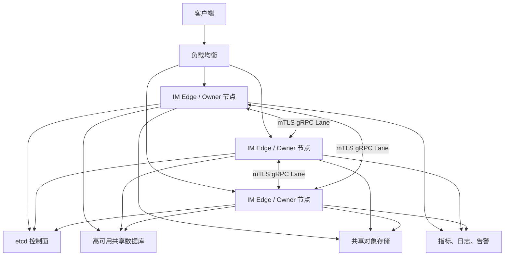
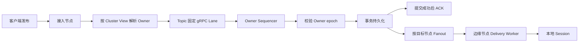

# IM 服务端生产集群版实施计划

> 文档信息
>
> - 更新日期：2026-07-29
> - 类型：实施与验收计划
> - 当前操作流程：[生产集群操作手册](../cluster-operations.md)
> - 适用环境：`staging`、`production`
> - 最小生产规模：3 个 IM 节点，推荐跨 3 个故障域
> - 当前结论：本地认证已完成，目标基础设施的 72 小时稳定性、数据库切换、
>   备份恢复和发布评审尚未完成

## 1. 最终目标

生产集群版是生产环境唯一允许的部署方式。开发单机版与生产集群版继续使用同一套业务代码和同一个二进制文件，通过显式运行环境、部署模式和启动校验区分。

必须遵守：

- `production` 环境不得以单机模式启动。
- 生产集群至少 3 个奇数节点；需要更高故障容忍度时使用 5 个节点。
- 集群异常时不得降级为多个独立单机节点继续写入。
- 失去多数派、Owner 租约或有效集群视图时，节点必须退出 Readiness 并拒绝写请求。
- 成功 ACK 表示消息已经持久化；节点宕机、重连和 Owner 迁移不得造成已 ACK 消息丢失。
- 集群传输采用至少一次投递和业务幂等，不承诺无法验证的“网络恰好一次”。
- 未通过本文档全部发布门禁前，只能标记为开发版或预览版。

## 2. 当前能力与生产差距

状态定义：

| 标记 | 含义 |
| --- | --- |
| ✅ | 代码已实现，并完成当前层级自动化验证 |
| 🟡 | 代码已实现，但真实目标环境的发布验收尚未完成 |
| 🔴 | 缺少生产必需代码或存在已确认的阻断缺陷 |
| ⬜ | 尚未开始实现 |

### 2.1 代码核对结果

| 状态 | 当前能力 | 代码现状 | 生产差距 |
| --- | --- | --- | --- |
| ✅ | 成员视图与一致性哈希 | etcd Lease、候选节点白名单、已提交活动拓扑和 256 虚拟节点 RingHash；3/5 节点固定样本偏差低于 10%，查询零堆分配 | 目标硬件容量由 CLUSTER-012 最终签字 |
| ✅ | Proxy Topic 与节点级 Multiplex Session | Master 按“Topic + 边缘节点”聚合投递目标，边缘节点再向本地 Session 扇出；五节点热点已完成 9600 次网络投递 | 目标硬件额定扇出归入 CLUSTER-012 |
| ✅ | 三/五节点故障转移 | 生产模式只使用 etcd Lease/Revision 和数据库 fence；旧 `cluster_leader.go` 不进入 staging/production 控制面 | 旧实现仅为开发兼容，不计入生产架构 |
| ✅ | 少数派写保护 | etcd 多数派 Readiness、数据库全局 fence、客户端与远端 Owner 写请求 fail-closed；真实进程覆盖 etcd 多数派丢失和节点隔离超过 Lease TTL | 目标网络设备分区演练归入 CLUSTER-012 |
| ✅ | 节点间传输 | 生产/预发布配置使用版本化 Protobuf Envelope、gRPC 双向流和每节点多条有序 Lane；`net/rpc` 仅保留开发兼容 | mTLS 由 CLUSTER-008 封闭 |
| ✅ | 断线重连 | 可靠请求保持 Request ID 有限重试；新流序号从 1 开始，服务端在有界 TTL 窗口内去重 | 超过重试上限或队列容量时明确失败，不再静默清空 |
| ✅ | 消息幂等与原子保存 | 客户端 `cid`；MySQL/PostgreSQL 在同一事务校验 fence、推进游标并保存消息；节点间 Request ID 去重；Owner SIGKILL 后历史和 seq 已验证 | 72 小时累计结果归入 CLUSTER-012 |
| ✅ | 控制面一致性 | 已通过真实 etcd 3.7.1：Lease、唯一注册、成员专用 epoch、Watch、多数派、Drain、任务短租约、Joining 和 CAS 3→5→3；租约丢失后 fail-closed 并自动重新注册 | 72 小时连续稳定性归入 CLUSTER-012 |
| ✅ | 集群身份认证 | gRPC 双向 TLS 1.3；etcd 客户端 mTLS；双方 CA 校验；`source_node` 必须匹配精确 DNS SAN；证书握手热加载和过期 Readiness；真实五进程使用独立节点证书 | 生产 CA 轮换和攻击演练归入 CLUSTER-012 |
| ✅ | Readiness、Drain 与拓扑运维 | `/livez`、`/readyz`、本机 `/drainz`、本机 `/clusterz`；综合数据库、etcd、View、Ring、数据面和队列水位；缩容强制先 Drain | 生产 RBAC 必须限制 Pod exec/主机本地权限 |
| 🟡 | Docker 三节点示例 | 已有 Compose 集群和本地启动脚本 | 包含开发默认值、暴露 pprof，只用于开发验证 |
| ✅ | Kubernetes 交付 | 已提供默认 3 副本、五候选身份 StatefulSet、Headless/Client Service、maxUnavailable=1 PDB、NetworkPolicy、探针、Drain、3→5→3 手册、CSI Secret 和安全上下文 | 真实集群 server-side dry-run 和故障演练归入 CLUSTER-012 |
| ✅ | 非 Kubernetes 交付 | 已提供 systemd 三/五主机模板、生产 YAML、Secret 示例、扩缩容及滚动手册 | 真实多主机演练归入 CLUSTER-012 |
| ✅ | 本地集群故障与容量测试 | 隔离三节点 etcd mTLS、MySQL 和五个真实 IM 进程已覆盖跨节点投递、Owner SIGKILL、RPO/seq、3→5→3、控制面/数据库失联、单节点隔离、滚动重启、重连风暴和 p99 | 结果见 `test-results/cluster-certification-latest.md`；目标生产基础设施仍需 CLUSTER-012 |

### 2.2 当前生产阻断项

以下外部验收未完成前不得进入生产：

1. Kubernetes 清单尚未在目标集群完成 server-side dry-run、真实 CSI 证书投影和跨故障域滚动演练。
2. 数据库平台的真实主备切换、备份恢复和回滚演练尚未完成；本地测试只验证数据库完全失联/恢复与 fencing。
3. 当前 p99 来自本机隔离环境，不代表目标节点、网络、数据库规格的额定容量签字。
4. 依赖/镜像/Secret 安全扫描和生产告警触发评审尚未形成报告。
5. 尚未在目标 staging 连续运行满 72 小时并完成生产发布评审。
6. N 与 N-1 的真实混合版本滚动升级、回滚和协议兼容窗口尚未在目标环境演练。

## 3. 范围与非目标

### 3.1 第一版生产范围

- 单地域、同城多可用区部署。
- 3 节点为最低规模，5 节点为高可用推荐规模。
- Topic 单逻辑 Owner，保证 Topic 内 seq 和处理顺序。
- 多节点分摊连接数、活跃 Topic 和不同 Topic 的吞吐。
- 节点级广播和边缘 Session 投递。
- PostgreSQL、MySQL 优先完成生产认证。
- MongoDB 仅在 Replica Set 和事务开启时认证。
- RethinkDB 保留兼容，不作为首批生产集群认证数据库。

### 3.2 第一版明确不做

- 跨地域多活和全球一致性。
- 单热点 Topic 的多主并行写入。
- 网络层“恰好一次”投递。
- 无边界的内存队列或无限重试。
- 没有协议兼容验证的跨大版本滚动升级。

## 4. 已确定的架构决策

原计划中“自研持久化选举或成熟组件二选一”不够明确。生产版按以下方案推进：

| 决策 | 结论 | 原因 |
| --- | --- | --- |
| 控制面 | 使用 etcd v3 Lease、Election 和事务维护成员及集群 epoch | 避免继续扩展不完整的自研共识协议 |
| 数据面 | 使用 Protobuf + gRPC 双向流式 Lane | 支持长连接、有序分片、流控和协议演进 |
| Topic Owner | 根据已提交的 Cluster View 和一致性哈希确定 | 保留现有分片思路，增加版本约束 |
| 写入保护 | Cluster epoch + Topic owner epoch fencing | 阻止旧 Owner 和少数派继续写入 |
| 投递语义 | 至少一次传输 + Request ID/Client ID 幂等 | 能够在断线后安全重试 |
| ACK 语义 | 数据库事务提交成功后 ACK | RPO=0 仅针对已成功 ACK 的消息 |
| 故障策略 | Fail closed | 无法确认控制面和 Owner 时拒绝写入 |
| 首批数据库 | PostgreSQL、MySQL | 已有事务型消息原子保存基础 |

如果最终不引入 etcd，必须先形成单独 ADR，证明替代方案具备持久化任期、单任期投票、租约、线性一致 CAS、watch 和故障恢复能力；不能直接把当前 `cluster_leader.go` 标记为生产共识。

## 5. 目标架构



部署要求：

- IM Deployment/StatefulSet 的期望副本数必须是大于等于 3 的奇数。
- etcd 自身必须使用独立的 3 或 5 节点高可用集群，并跨故障域部署。
- 数据库必须具备主备切换和经过验证的备份恢复能力。
- 负载均衡只能把新连接转发到 Readiness 正常的 IM 节点。
- 节点本地磁盘不得保存唯一消息、媒体或控制面状态。

### 5.1 控制面

控制面只管理小体量强一致状态，不承载聊天消息：

- Cluster ID 和协议版本。
- 节点身份、租约和广播地址。
- 已提交的成员列表。
- 单调递增的 Cluster View epoch。
- Drain 状态和 Owner 迁移协调。

Topic Owner 通过 Cluster View 和一致性哈希计算，不为每个 Topic 在 etcd 中创建常驻键，避免控制面随 Topic 数线性膨胀。

### 5.2 数据面



约束：

- `lane = hash(topic) % lane_count`，同一 Topic 固定进入同一 Lane。
- 可靠消息和瞬态事件使用不同队列。
- 可靠队列满时明确拒绝，不能覆盖或静默丢弃。
- Typing、Presence 等瞬态事件可以合并或丢弃，但必须记录指标。
- Master 每条广播最多向每个目标边缘节点发送一次。
- 边缘节点负责本地 Session 扇出，慢客户端只影响自身或所在投递分片。

### 5.3 写入 fencing

仅依赖“当前节点认为自己是 Owner”不足以避免双写。写入必须携带：

- `cluster_epoch`：已提交 Cluster View 的版本。
- `owner_epoch`：该 Topic 当前 Owner 的任期。
- `request_id`：节点间可靠请求的幂等键。
- `client_id`：客户端发布幂等键，沿用现有 `cid`。

数据库事务需要校验 epoch 后再推进 Topic seq 和保存消息。过期 Owner 的事务必须失败，返回可重试的集群状态错误。

## 6. 目标配置

生产配置使用 `configs/im.cluster.yaml`。下面是当前代码已经支持的核心结构：

```yaml
runtime:
  environment: production
  deployment_mode: cluster

health:
  live_path: /livez
  ready_path: /readyz
  drain_path: /drainz
  topology_path: /clusterz
  drain_timeout: 15s

cluster_config:
  cluster_id: im-production
  self: im-0
  expected_replicas: 3
  initial_members: [im-0, im-1, im-2]
  advertise_addr: im-0.im-headless:12000
  nodes:
    - {name: im-0, addr: im-0.im-headless:12000}
    - {name: im-1, addr: im-1.im-headless:12000}
    - {name: im-2, addr: im-2.im-headless:12000}
    - {name: im-3, addr: im-3.im-headless:12000}
    - {name: im-4, addr: im-4.im-headless:12000}

  control_plane:
    provider: etcd
    endpoints:
      - https://etcd-0.etcd:2379
      - https://etcd-1.etcd:2379
      - https://etcd-2.etcd:2379
    namespace: /im/production
    lease_ttl: 10s
    dial_timeout: 5s
    tls:
      ca_file: /run/secrets/etcd/ca.pem
      cert_file: /run/secrets/etcd/client.pem
      key_file: /run/secrets/etcd/client-key.pem
      server_name: etcd

  transport:
    listen: 0.0.0.0:12000
    lane_count: 8
    reliable_queue_capacity: 4096
    ephemeral_queue_capacity: 1024
    dial_timeout: 3s
    request_timeout: 5s
    max_retries: 2
    retry_backoff: 100ms
    dedupe_capacity: 65536
    dedupe_ttl: 2m

  tls:
    ca_file: /run/secrets/cluster-ca.pem
    cert_file: /run/secrets/cluster-cert.pem
    key_file: /run/secrets/cluster-key.pem
```

配置原则：

- 生产最少 3 个 IM 节点是代码硬约束，不提供可调低的 `minimum_nodes`。
- `expected_replicas` 与 `initial_members` 定义首次活动奇数拓扑；`nodes` 是所有节点一致的候选白名单，可以预声明五个身份。
- 运行时多数派根据 etcd 已提交拓扑计算；只能通过本机 `/clusterz` 执行相邻奇数规模变更，不能直接调低配置阈值。
- 节点进程允许按顺序启动，但在存活节点未达到多数派前保持 Not Ready 并拒绝写入，避免集群冷启动死锁。
- 多数派和 fencing 在生产环境不可关闭，不提供 `require_quorum: false` 逃生开关。
- 证书私钥、数据库密码和 Agora 证书只通过 Secret 挂载或环境变量注入。
- Viper 环境变量覆盖继续使用 `IM_` 前缀和双下划线层级。
- 配置校验必须发生在监听客户端端口和启动业务 Worker 之前。
- 提供 `im-server --validate_config --config=...` 离线检查。

## 7. 工作分解

| ID | 优先级 | 状态 | 任务 | 前置依赖 | 主要交付 |
| --- | --- | --- | --- | --- | --- |
| CLUSTER-001 | P0 | ✅ | 显式运行环境与生产强制集群门禁 | 无 | 配置结构、校验器、测试 |
| CLUSTER-002 | P0 | ✅ | etcd 成员租约与 Cluster View epoch | 001 | 控制面接口与实现 |
| CLUSTER-003 | P0 | ✅ | Topic Owner epoch 与数据库 fencing | 002 | Schema、事务校验、适配器测试 |
| CLUSTER-004 | P0 | ✅ | gRPC 双向流式有序 Lane | 001 | Proto、连接管理、Lane |
| CLUSTER-005 | P0 | ✅ | 可靠/瞬态队列、重试、去重和背压 | 004 | 传输状态机与指标 |
| CLUSTER-006 | P0 | ✅ | 节点级 Fanout 与边缘投递 | 004、005 | Delivery Envelope 与 Worker |
| CLUSTER-007 | P0 | ✅ | Readiness、Liveness 和 Drain | 002、005 | HTTP 接口与状态机 |
| CLUSTER-008 | P0 | ✅ | mTLS、节点身份和协议协商 | 004 | TLS 配置与轮换测试 |
| CLUSTER-009 | P1 | ✅ | Owner 迁移、扩缩容和定时任务领取 | 002、003、007 | Joining 候选、CAS 3→5→3、缩容前 Drain、动态多数派和任务短租约 |
| CLUSTER-010 | P1 | ✅ | Kubernetes 和三节点部署物 | 007、008 | StatefulSet、PDB、NetworkPolicy、systemd 和运维手册 |
| CLUSTER-011 | P0 | ✅ | 三/五节点故障与容量测试自动化 | 003～010 | 五进程 mTLS 集群、SIGKILL、依赖故障、隔离、滚动、热点/重连 p99 和审计报告 |
| CLUSTER-012 | P0 | 🟡 | 72 小时稳定性和目标环境发布演练 | 011 | `scripts/certify-cluster-72h.sh` 已具备且强制 ≥72h、不可变 SHA-256；必须在真实 staging 跑满并完成人工评审 |

### 7.1 代码落点

| 领域 | 主要文件或目录 |
| --- | --- |
| 配置与启动门禁 | `internal/server/main.go`、`internal/configutil/`、`configs/` |
| 现有集群与迁移入口 | `internal/server/cluster.go`、`internal/server/cluster_leader.go` |
| Proxy 路由 | `internal/server/topic_proxy.go`、`internal/server/session.go` |
| gRPC 协议 | `api/pbx/model.proto`、新增 cluster transport 包 |
| Topic 写入 | `internal/server/topic_msg.go`、`server/store/store_messages.go` |
| 数据库 fencing | `server/db/postgres/`、`server/db/mysql/`、`server/db/mongodb/` |
| Readiness 与监控 | `internal/server/main.go`、`internal/server/http.go`、`internal/server/stats.go` |
| 定时任务 | `internal/server/scheduled_messages.go` |
| 部署 | `deployments/`、`scripts/` |
| 压测与故障测试 | `tests/load/`、新增 `tests/cluster/` |

### 7.2 已完成实现核对

| ID | 代码交付 | 验证 |
| --- | --- | --- |
| CLUSTER-004 | `api/pbx/model.proto` 增加 `ClusterTransport.Lane` 和版本化 `ClusterFrame`；`internal/server/cluster_transport_grpc.go` 实现共享 HTTP/2 连接、多 Lane、Topic 稳定分片、身份/版本/Ring/epoch 校验和重连序号重置 | 真实内存 gRPC 双向流测试覆盖同 Topic 顺序、断流重建和响应关联校验 |
| CLUSTER-005 | 可靠与瞬态双队列、可靠优先调度、有限指数退避、同 Request ID 重试、节点级有界 TTL 去重、碰撞拒绝、明确可靠背压及瞬态丢弃指标 | 重试保持 Request ID、并发去重只执行一次、可靠队列满明确错误、瞬态队列满安全丢弃；目标测试通过 race |
| CLUSTER-006 | Master 按“Topic + 边缘节点”聚合 Multiplex 目标；每目标仅一个投递 Worker；同步送入同 Topic Lane；边缘节点接收后向本地 Session 扇出；业务队列满返回明确错误 | 四个远端 Session 分布在两个边缘节点时，跨节点只发送两份 Envelope |
| CLUSTER-007 | 固定健康探针、数据库主动检查、控制面/View/Ring/数据面/队列综合 Readiness、本机 Drain 状态机、新连接门禁、已有连接读写分离、远端写 fail-closed 和可靠队列排空 | Ready→Drain→Not Ready、远端 Drain 拒绝、数据库/多数派/队列原因、写命令分类和 Drain 超时测试通过 race |
| CLUSTER-008 | `cluster_config.tls` 生产强制门禁；双向 TLS 1.3；客户端和服务端 CA 校验；证书 DNS SAN 与静态节点名精确绑定；禁止通配符冒充；新握手热加载证书/私钥；协议最小/最大版本协商 | 真实内存 gRPC mTLS、证书轮换、错误节点身份、协议范围和生产缺失 TLS 门禁测试通过 race |
| CLUSTER-009 | `nodes` 作为候选白名单、`initial_members` 创建首次活动拓扑；新节点先 Joining；`/clusterz` 仅本机调用并通过 etcd ModRevision CAS 提交相邻奇数规模；扩容要求新节点在线，缩容要求先 Drain；运行时多数派随已提交拓扑变化 | 单元测试、真实 etcd 集成测试和五进程 3→5→3 均通过；不同配置、跳过 Drain、缺失成员和并发修改均 fail-closed |
| CLUSTER-010 | `deployments/kubernetes/` 提供固定 digest、默认三副本/五候选 StatefulSet、maxUnavailable=1 PDB、拓扑分散、NetworkPolicy、探针、preStop Drain、只读根文件系统和 CSI Secret；`deployments/systemd/` 提供三/五主机模板；操作手册覆盖 3→5→3 | Kustomize 成功渲染，全部 YAML 可解析，关键资源离线校验通过；真实 Kubernetes server-side dry-run 和跨故障域滚动演练留待 CLUSTER-012 |
| CLUSTER-011 | Ring 虚拟节点 256、零分配查询；`tests/cluster/process_test.go` 和 `scripts/test-cluster-process.sh` 创建三节点 etcd mTLS、MySQL、五个 IM 进程与一次性节点证书；生成带二进制 SHA-256 的审计报告 | 10 万 Topic 样本最大偏差低于 10%；核心 race 三轮通过；Owner SIGKILL RTO 4s；32×300 热点投递 9600 次，ACK p99 31.68ms、投递 p99 31.77ms；256 路重连通过 |

## 8. 实施阶段与退出条件

阶段严格按依赖推进。后续阶段可以并行开发，但不能绕过前一阶段的退出条件发布。

### M0：安全基线

任务：

- 完成 CLUSTER-001。
- 为当前重连清空队列、少数派判断和选举行为补回归测试。
- 将现有 Docker Compose 与 `scripts/run-cluster.sh` 明确标记为开发用途。
- 禁止生产默认暴露 pprof、空数据库密码和示例密钥。

退出条件：

- `production + standalone` 必定启动失败。
- 期望副本数少于 3、不是奇数、节点身份缺失或未配置内部认证时启动失败。
- 实际存活节点不足多数派时进程可以启动，但必须保持 Not Ready 并拒绝写入。
- 当前高风险行为都有可重复失败测试，防止重构时掩盖问题。

### M1：一致性控制面

任务：

- ✅ 完成 CLUSTER-002、CLUSTER-003。
- ✅ 引入 etcd 租约、成员 Watch 和成员变更专用 Cluster View epoch。
- ✅ 为 Topic Owner 增加数据库全局 epoch 与 Topic owner epoch 双重 fencing。
- ✅ PostgreSQL、MySQL 完成 Schema、事务实现和真实数据库组件测试。
- ✅ MongoDB Replica Set 实现事务校验；RethinkDB 在控制面模式下由配置门禁拒绝。
- 旧 `cluster_leader.go` 退出生产控制面，只保留迁移期开发兼容或最终删除。

退出条件：

- 三节点网络分区时只有持有有效多数派租约的一侧允许写入。
- 旧 Owner 在迁移后无法推进 Topic seq。
- Owner 切换期间客户端使用相同 `cid` 重试不会重复落库。

### M2：可靠数据面

任务：

- ✅ 完成 CLUSTER-004、CLUSTER-005、CLUSTER-006。
- ✅ 建立可测试的 gRPC Lane；由 CLUSTER-008 继续封闭非 TLS 入口。
- ✅ 实现 Request ID、确认、超时、有限重试和有界去重窗口。
- ✅ 删除重连时清空可靠队列的行为。
- ✅ 广播按目标边缘节点生成一次 Envelope 并 Fanout。

退出条件：

- 同一 Topic 跨节点请求顺序稳定。
- 断线重连不会静默丢弃已经接收的可靠请求。
- 队列满时发布请求收到明确可重试错误。
- 跨节点消息数与目标节点数相关，不再与远程 Session 数或离线成员数线性增长。

### M3：生产运维面

任务：

- ✅ 完成 CLUSTER-007、CLUSTER-008、CLUSTER-009、CLUSTER-010。
- ✅ 实现 Liveness、Readiness、可靠队列 Drain 和基于 Cluster View 的 Owner 迁移，并提供滚动升级交付。
- ✅ 启用双向 mTLS、节点身份校验和协议版本协商。
- ✅ 提供 Kubernetes 与非 Kubernetes 三节点部署。
- ✅ 完成证书轮换、数据库切换、3→5→3 在线扩缩容和回滚手册。

退出条件：

- 负载均衡只向 Ready 节点转发新连接。
- Drain 节点不接收新连接，可靠队列排空或达到明确超时后退出。
- N 与 N-1 版本能够在规定窗口内滚动升级。
- 无认证客户端无法连接集群内部端口。

### M4：生产认证

任务：

- ✅ 完成 CLUSTER-011 的本地故障与容量自动化；在目标 staging 完成 CLUSTER-012。
- 在固定硬件、数据库和网络环境记录容量基线。
- 完成故障矩阵和连续 72 小时稳定性测试。
- 完成安全、备份恢复、监控告警和回滚演练。

退出条件：

- 全部 SLO 和发布门禁通过。
- 形成可审计报告。
- 版本才可以从“集群预览版”升级为“生产集群版”。

## 9. Readiness、Liveness 与 Drain

### 9.1 Liveness

Liveness 只判断进程是否需要重启：

- 主事件循环仍在运行。
- 没有不可恢复的内部死锁或 panic 状态。

数据库或 etcd 暂时不可用不应立即触发无限重启，应通过 Readiness 摘流并告警。

### 9.2 Readiness

生产节点只有同时满足以下条件才 Ready：

- 数据库连接正常，Schema 版本兼容。
- etcd 会话和节点租约有效。
- 已获得包含本节点的有效 Cluster View。
- 存活 Serving 节点达到 etcd 已提交活动拓扑计算出的多数派。
- Cluster View epoch、Ring 签名和协议版本一致。
- 节点不处于 Drain、少数派或 Owner 迁移阻塞状态。
- 可靠队列低于拒绝水位。
- gRPC Lane、客户端监听器和必要 Worker 已初始化。
- 集群证书有效期、磁盘空间和时钟偏差处于安全范围。

失去 Readiness 后：

- 停止接收新连接。
- 发布、ACL 修改、删除和成员变更等写请求明确失败。
- 已存在连接允许完成安全的只读操作或收到可重试错误。
- 不得切换为本地 Owner 继续独立写入。

### 9.3 Drain

Drain 顺序：

1. 从 Readiness 摘除。
2. 停止接收新连接和新 Owner。
3. 通知客户端重连或等待连接自然迁移。
4. 将本节点 Owner 迁移到新 Cluster View。
5. 排空可靠 Lane、Delivery 和后台任务队列。
6. 达到完成条件后退出；超时则明确记录未完成任务并返回非零状态。

## 10. SLO 与容量门槛

以下是首版生产基线，最终容量数字必须绑定硬件、数据库规格、消息大小和连接模型：

| 指标 | 发布门槛 |
| --- | --- |
| 已 ACK 消息 RPO | 0 |
| 单 Topic seq 回退 | 0 |
| 幂等重试重复落库 | 0 |
| 单节点故障恢复 RTO | 不超过 15 秒 |
| 少数派停止写入 | 不超过租约 TTL + 2 秒 |
| 发布 ACK p99 | 额定负载下不超过 300ms |
| 在线消息投递 p99 | 额定负载下不超过 500ms |
| 集群单跳传输 p99 | 同地域额定负载下不超过 50ms |
| 可靠队列持续高水位 | 不允许连续 5 分钟超过 80% |
| 稳定性测试 | 连续 72 小时，无可靠性违规 |

额定负载必须在 CLUSTER-011 中明确：

- 节点 CPU、内存和网卡规格。
- 数据库类型、版本、拓扑和连接池。
- 节点数、连接数、在线率和 Topic 数。
- 消息 QPS、平均/最大消息大小和广播扇出。
- TLS、压缩、日志和监控配置。

## 11. 监控与告警

必须监控：

- 节点状态、租约 TTL、Cluster View epoch 和 Ring 签名。
- 当前连接数、活跃 Topic、Proxy Topic 和 Owner Topic 数。
- 每条 Lane 的连接状态、队列深度、吞吐和 p95/p99 延迟。
- Request ID 重试、去重命中、超时和最终失败数。
- Owner 迁移次数、耗时、失败和 fencing 拒绝数。
- 可靠消息拒绝数和瞬态事件合并/丢弃数。
- 数据库连接等待、事务耗时、冲突和慢查询。
- ACK、在线投递和历史同步延迟。
- 慢客户端断开和客户端重连速率。

必须告警：

- 节点租约失效或集群失去多数派。
- Cluster View、Ring 或协议版本不一致。
- 任意生产节点退出 Readiness。
- 可靠消息出现最终失败。
- 发现过期 Owner 写入或 fencing 拒绝突增。
- 数据库连接池耗尽或持久化 p99 超阈值。
- Lane 队列持续积压。
- 证书即将过期、Secret 版本不一致或时钟偏差超限。

## 12. 测试矩阵

| 场景 | 必须结果 |
| --- | --- |
| 正常三节点运行 | Topic 均匀分布，跨节点发布和投递正确 |
| 任意单节点宕机 | 多数派继续服务，客户端重连后历史完整 |
| Owner 节点宕机 | 新 Owner 获得更高 epoch，旧 Owner 无法继续写入 |
| 三节点失去一个节点 | 剩余两个节点继续处理写入 |
| 三节点只剩一个节点 | 少数派退出 Readiness 并拒绝写入 |
| 1/2 网络分区 | 只有两节点多数派一侧允许写入 |
| 双向流中断和重连 | 可靠请求重试或明确失败，不静默丢弃 |
| 队列达到容量 | 可靠消息明确拒绝，瞬态事件按策略丢弃 |
| etcd 短暂不可用 | 租约有效期内按策略运行，过期后停止写入 |
| Owner 迁移 | seq 单调，`cid` 重试不重复落库 |
| 滚动升级 | N/N-1 协议兼容，可用容量满足目标 |
| 扩容和缩容 | 迁移期间消息不丢失、不乱序 |
| 数据库主备切换 | 背压生效，恢复后幂等重试 |
| 数据库延迟 100ms | 队列有界，入口明确拒绝过载 |
| 慢客户端 | 只影响自身或所在 Delivery 分片 |
| 重连风暴 | 登录、订阅恢复和历史同步不压垮数据库 |
| 证书轮换 | 新旧证书重叠期内连接平滑迁移 |

测试层级：

- 单元测试：状态机、Lane 分片、重试、去重、epoch 和配置校验。
- 组件测试：真实 gRPC、etcd 和数据库。
- 三节点集成测试：进程级启动、分区、宕机和恢复。
- 压测：多 Topic、热点群组、热点频道和重连风暴。
- 混沌测试：网络延迟、丢包、断连、进程终止和依赖故障。
- 数据竞争测试：集群核心包必须通过 `go test -race`。

## 13. 发布、升级与回滚

### 13.1 发布

- 先在 staging 运行与生产相同的 3 节点拓扑。
- 通过配置校验、Schema 兼容检查和协议兼容检查。
- 先部署一个 Drain 后的 canary 节点。
- 观察至少一个完整高峰窗口，再逐节点滚动。
- 每次只升级一个故障域中的一个节点。

### 13.2 回滚

- 数据库变更采用 expand/migrate/contract，滚动窗口内保持向后兼容。
- 新协议至少兼容 N-1 版本。
- 发现可靠性违规、fencing 异常或多数派异常时立即停止发布。
- 回滚同样先 Drain，禁止直接终止仍持有 Owner 的节点。
- 已完成不兼容 Schema 收缩后不得直接二进制回滚。

## 14. 交付物

- `configs/im.cluster.yaml` 生产集群配置模板。
- 控制面和数据面 ADR。
- Protobuf 集群协议及兼容策略。
- etcd、数据库 Schema 和迁移脚本。
- `/livez`、`/readyz` 和 Drain 接口。
- Kubernetes StatefulSet、Headless Service、Service、PDB 和 NetworkPolicy。
- 非 Kubernetes 三节点部署示例。
- mTLS、证书轮换和 Secret 管理说明。
- 扩缩容、节点替换、数据库切换和回滚手册。
- 三节点与五节点容量报告。
- 故障演练、72 小时稳定性和安全评审报告。

## 15. 生产发布门禁

以下条件必须全部满足：

- CLUSTER-001 至 CLUSTER-012 全部完成。
- 生产环境单机启动已被代码硬性禁止。
- 72 小时压测无已 ACK 消息丢失、重复落库或 seq 回退。
- 网络分区时只有持有有效多数派租约的一侧能够写入。
- 旧 Owner 的写入能够被数据库 fencing 拒绝。
- 单节点故障、滚动升级、扩缩容和数据库切换演练通过。
- p95/p99、最大连接数和消息吞吐达到已批准容量目标。
- 安全扫描、依赖扫描、默认密钥检查和 mTLS 验证通过。
- 备份恢复、告警触发和版本回滚经过实际演练。
- 所有结果形成可审计报告并经过发布评审。

## 16. 立即执行顺序

1. ✅ CLUSTER-001 已完成：显式环境、部署模式、离线配置检查和生产启动门禁。
2. ✅ CLUSTER-002 已完成：真实 etcd 下的三 IM 节点租约、Watch、成员专用 epoch、多数派和注销测试通过。
3. ✅ CLUSTER-003 已完成：PostgreSQL/MySQL 真实组件验证旧 Owner 拒绝、新 Owner 接管和 fence 防回退。
4. ✅ CLUSTER-004 已完成：gRPC 双向流、多 Lane、同 Topic 有序、协议和 Cluster View 校验。
5. ✅ CLUSTER-005 已完成：可靠/瞬态双队列、有限重试、去重窗口、明确背压和指标。
6. ✅ CLUSTER-006 已完成：每个目标边缘节点一次 Fanout、单 Worker 有序投递和本地 Session 扇出。
7. ✅ CLUSTER-007 已完成：Liveness、综合 Readiness、本机 Drain、可靠队列排空和 fail-closed 写入门禁。
8. ✅ CLUSTER-008 已完成：双向 mTLS、节点证书身份、证书热加载和协议范围协商。
9. ✅ CLUSTER-009 已完成：Joining 候选节点、etcd CAS 3→5→3、动态多数派、缩容前 Drain 和定时任务短租约。
10. ✅ CLUSTER-010 已完成：Kubernetes 与 systemd 三节点生产部署物、生产配置、离线清单校验和操作手册。
11. ✅ CLUSTER-011 已完成本地自动化：三节点 etcd mTLS、五个 IM 进程、跨节点投递、Owner SIGKILL、单节点隔离、3→5→3、依赖失联、滚动重启、热点与重连 p99。
12. 🟡 CLUSTER-012 已具备不可缩短至 72 小时以下、绑定不可变 SHA-256 的可执行门禁和单次审计报告；下一步必须在目标 Kubernetes/systemd、数据库 HA 和监控环境实际跑满 72 小时，完成备份恢复、安全扫描和发布评审。

在 CLUSTER-012 的外部验收证据齐全前，代码可以进入 staging，但不能宣称已经获得生产发布签字。
