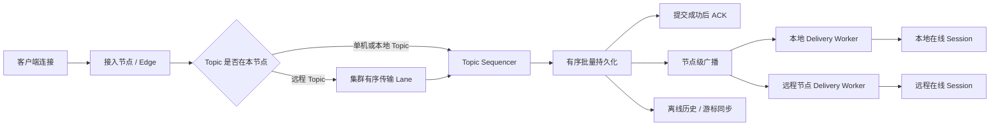
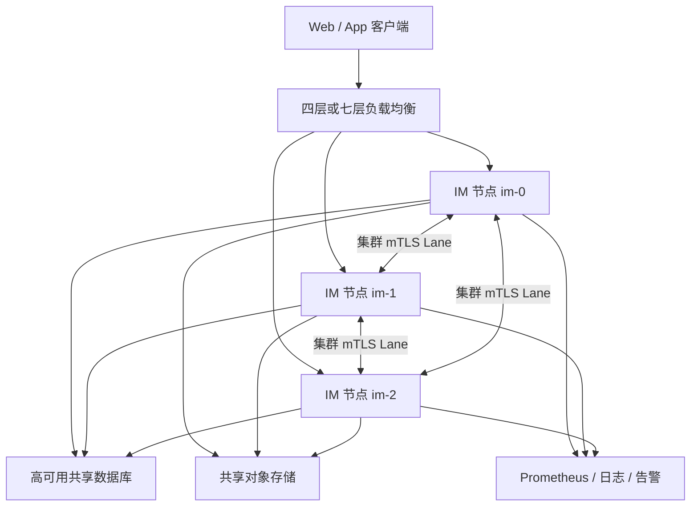

# 服务端性能与部署模式路线图

> 文档信息
>
> - 更新日期：2026-07-29
> - 类型：规划记录，不作为部署操作手册
> - 当前状态：分析完成；生产集群版尚未达到发布门槛

## 分版本计划

- [开发单机版计划](standalone.md)：用于本地开发、自动化测试、演示和问题定位，禁止用于生产环境。
- [生产集群版计划](cluster.md)：生产环境唯一允许的部署版本，至少运行 3 个服务节点。

## 1. 目标

本计划用于指导 IM 服务端后续性能优化。项目保留同一套业务代码和同一个二进制文件，但明确划分两个部署档位：

- 开发单机版：仅用于本地开发、自动化测试、功能演示和故障定位，不得用于生产环境。
- 生产集群版：生产环境唯一允许的运行方式，至少 3 个服务节点，能够横向扩展连接数、活跃 Topic 数和整体消息吞吐。
- 热点群组与频道：保持 Topic 内消息顺序，同时允许投递阶段横向扩展。
- 可靠消息：已经确认接收的消息不得因为队列满、节点重连或故障迁移而静默丢失。
- 可观测性：能够明确定位入口、Topic、数据库、集群传输、序列化和客户端写入等阶段的瓶颈。

生产环境必须满足以下总原则：

- 不提供生产单机版，也不允许生产集群在故障时自动降级成单机继续写入。
- 生产配置缺少集群身份、节点列表、故障转移、多数派或必要安全配置时，进程必须启动失败。
- 集群失去多数派或 Ring 状态不一致时，节点必须退出 Readiness 并拒绝写入，避免脑裂。
- 是否达到“生产可用”以本计划的发布门禁和故障演练结果为准，不能以进程可以启动或三节点可以互连作为依据。

## 2. 状态说明

| 标记 | 含义 |
| --- | --- |
| ✅ | 当前已经具备，可继续保留 |
| 🟡 | 已有基础，但需要优化或加固 |
| ⬜ | 尚未实施 |
| 🔴 | 当前高风险问题，应优先处理 |

## 3. 当前结论

当前项目已经实现显式单机/集群模式、生产强制集群启动门禁、etcd 成员控制面和数据库 Owner fencing，但可靠集群传输、Readiness/Drain、mTLS、故障与容量认证仍未完成。现阶段集群只能用于开发和验证，不得作为生产集群版发布。

现有集群主要能够分摊：

- 客户端连接数。
- 活跃 Topic 数量。
- 不同 Topic 的消息负载。

现有集群暂时不能有效突破：

- 单个热点 Topic 的串行持久化上限。
- 单个热点群组或频道的本地广播上限。
- Proxy 到 Master 的逐请求同步 RPC 上限。
- 普通群逐成员离线通知造成的内部消息放大。

### 3.1 可以保留的基础

| 状态 | 能力 | 说明 |
| --- | --- | --- |
| ✅ | Topic Actor 模型 | 单 Topic 由一个协程串行处理，容易保证 seq 和消息顺序 |
| ✅ | 单机/集群运行模式 | `cluster_config.self` 为空时运行单机模式 |
| ✅ | Topic 一致性哈希 | 不同 Topic 可以分配到不同节点 |
| ✅ | 节点级 Multiplex Session | Master 原则上只需向每个边缘节点发送一份广播 |
| ✅ | 消息幂等键 | 已具备 Client ID 和数据库唯一索引 |
| ✅ | 消息与 Topic 游标事务 | MySQL、PostgreSQL 等适配器支持原子提交 |
| ✅ | 慢客户端保护 | Session 出站队列满时会断开卡顿连接 |
| 🟡 | expvar/Prometheus 监控 | 已有基础指标，但缺少热路径和队列指标 |
| 🟡 | Go 分布式压测 | 已有可复现场景和结构化报告，但没有形成当前版本的容量基线 |

## 4. 目标架构

继续保留“单 Topic 单 Sequencer”，不直接改成多主写入。消息排序和持久化由一个逻辑 Owner 负责，投递阶段按节点或 Session 分片。



### 4.1 单机模式

- 单机模式正式定义为“开发单机版”，只允许 `development` 或 `test` 运行环境使用。
- `LocalTopicResolver` 直接返回本地 Topic。
- `LocalTransport` 直接调用本地队列，不创建集群 RPC、代理 Topic 或 Multiplex Session。
- Topic Sequencer、存储管线、Delivery Worker 与集群模式复用。
- 当运行环境为 `production` 时，如果集群未启用，服务必须立即启动失败。

### 4.2 集群模式

- Topic 仍只有一个逻辑 Owner，负责 seq、幂等和持久化顺序。
- 节点之间使用长连接流式传输。
- 同一 Topic 固定映射到同一传输 Lane，保持有序。
- Master 每条消息最多向每个存在在线订阅者的边缘节点发送一份数据。
- 边缘节点负责本地 Session 扇出，不在 Master 上逐远程 Session 投递。
- 生产集群至少包含 3 个服务节点，并以奇数节点运行；5 个节点作为跨故障域部署的推荐起点。
- 集群异常时不得退化为各节点独立处理写入。

### 4.3 热点频道

- Sequencer 仍保持单写者，避免 seq 冲突。
- Delivery 与 Sequencer 解耦，允许按节点或 Session 分片并行。
- 在线用户实时投递。
- 离线用户通过历史消息和游标同步，不执行逐用户实时内部通知。

### 4.4 生产集群版

生产集群版不是另一套代码分支，而是同一二进制文件的强约束部署档位。建议新增显式配置：

```yaml
runtime:
  environment: production
  deployment_mode: cluster

cluster_config:
  cluster_id: im-production
  self: im-0
  expected_replicas: 3
  advertise_addr: im-0.im-headless:12000
  control_plane:
    provider: etcd
    endpoints:
      - https://etcd-0.etcd:2379
      - https://etcd-1.etcd:2379
      - https://etcd-2.etcd:2379
  transport:
    listen: 0.0.0.0:12000
```

最终字段和实施依赖以 [生产集群版实施计划](cluster.md) 为准，但必须表达以下语义：

| 部署档位 | 允许环境 | 服务节点 | 集群要求 | 用途 |
| --- | --- | ---: | --- | --- |
| 开发单机版 | `development`、`test` | 1 | 不启用 | 本地开发、测试和演示 |
| 预发布集群版 | `staging` | 至少 3 | 与生产相同 | 压测、升级和故障演练 |
| 生产集群版 | `production` | 至少 3，推荐 5 | 强制启用、多数派可用 | 正式业务流量 |

#### 4.4.1 启动硬门禁

新增统一的生产配置校验器，在启动监听客户端端口之前完成检查。任一条件不满足都必须返回明确错误并退出：

- `runtime.environment=production` 时，`deployment_mode` 必须为 `cluster`。
- `cluster_config.self`、`cluster_id`、本节点地址和控制面配置必须完整。
- `expected_replicas` 必须为大于等于 3 的奇数，并与部署系统期望副本数一致。
- 多数派写保护和 Owner fencing 在生产环境不可关闭。
- 所有节点必须使用相同的 Cluster ID、Ring 版本、协议版本和成员配置指纹。
- 数据库必须是所有节点共享的生产实例，禁止 SQLite、内存存储或节点本地独立数据库。
- 集群内部通信必须启用认证；生产目标为 mTLS，并禁止使用默认密钥。
- API Key、认证密钥、Agora 证书和对象存储凭据不得使用示例值。

#### 4.4.2 Readiness 与流量门禁

进程启动不等于可以接收流量。生产节点只有同时满足以下条件才能通过 Readiness：

- 数据库可连接，并且 Schema 版本一致。
- 已连接多数集群成员，当前节点看到的 Ring 版本和成员配置指纹一致。
- 当前节点未处于 Drain、脑裂、数据迁移或可靠队列超限状态。
- 集群内部 Lane、客户端监听器和必要后台 Worker 已完成初始化。
- 时钟偏差、磁盘空间和证书有效期没有超过告警阈值。

失去多数派时，节点必须立即退出 Readiness 并拒绝发布、ACL 修改、删除等写请求；历史读取是否继续开放由一致性和数据源健康状态决定。

#### 4.4.3 最小生产拓扑



最低要求：

- 3 个 IM 节点分布在至少 3 个故障域；更高可用场景使用 5 个节点。
- 客户端通过负载均衡接入，负载均衡只转发到 Readiness 正常的节点。
- 使用高可用共享数据库和共享对象存储，节点本地磁盘不保存唯一业务数据。
- 所有节点采用统一 Secret、协议版本和配置版本，但拥有唯一节点身份。
- 至少部署指标、集中日志和告警；无监控的集群不得进入生产。

#### 4.4.4 交付物

- 生产集群配置模板，不包含任何真实密钥和示例弱密钥。
- Kubernetes StatefulSet、Headless Service、Service、PodDisruptionBudget、NetworkPolicy 和滚动升级配置。
- `/livez`、`/readyz` 和节点 Drain 接口。
- 集群配置检查命令，例如 `im-server config validate --production`。
- 集群扩容、缩容、节点替换、证书轮换、数据库故障和回滚手册。
- 三节点与五节点容量报告、故障演练报告和版本兼容矩阵。

#### 4.4.5 生产发布门禁

以下项目全部通过后，才允许将版本标记为“生产集群版”：

- 连续 72 小时稳定性压测无已 ACK 消息丢失、重复落库或 Topic seq 回退。
- 任意单节点宕机后自动恢复，客户端能够重连并完成离线历史同步。
- 三节点环境失去一个节点仍可写；失去多数派后所有剩余少数派节点拒绝写入。
- 完成网络分区、节点重启、滚动升级、数据库主备切换和重连风暴演练。
- 扩容、缩容和 Owner 迁移过程中不发生消息乱序或未确认的静默丢弃。
- p95、p99 延迟、最大连接数、消息吞吐和资源水位达到正式确定的容量目标。
- 安全扫描、依赖扫描、密钥检查、备份恢复和监控告警演练全部通过。
- 回滚方案经过实际演练，并验证新旧版本的集群协议兼容窗口。

## 5. 优先级总览

| ID | 优先级 | 状态 | 优化项 | 主要收益 |
| --- | --- | --- | --- | --- |
| CLUSTER-001 | P0 | ✅ | 增加生产模式与强制集群启动门禁 | 防止生产误用单机模式 |
| CLUSTER-002 | P0 | ✅ | etcd 成员租约与 Cluster View epoch | 建立一致性控制面 |
| CLUSTER-003 | P0 | ✅ | Topic Owner epoch 与数据库 fencing | 阻止旧 Owner 双写 |
| CLUSTER-004 | P0 | ✅ | gRPC 双向流式有序 Lane | 消除同步 RPC 阻塞 |
| CLUSTER-005 | P0 | ✅ | 可靠/瞬态队列、重试、去重和背压 | 防止静默丢失 |
| CLUSTER-006 | P0 | ✅ | 节点级 Fanout 与边缘投递 | 提升大群广播能力 |
| CLUSTER-007 | P0 | ✅ | Readiness、Liveness 和 Drain | 支持安全接流和升级 |
| CLUSTER-008 | P0 | ✅ | mTLS、节点身份和协议协商 | 保护内部通信 |
| CLUSTER-009 | P1 | ✅ | Owner 迁移、扩缩容和定时任务领取 | 支持弹性运维 |
| CLUSTER-010 | P1 | ✅ | Kubernetes 和三节点部署物 | 形成可重复交付 |
| CLUSTER-011 | P0 | ✅ | 三/五节点故障与容量测试 | 验证可靠性和容量 |
| CLUSTER-012 | P0 | 🟡 | 72 小时稳定性和发布演练 | 代码门禁已完成，等待目标环境实际验收 |
| PERF-001 | P0 | ⬜ | 建立真实性能基线与热路径指标 | 优化结果可验证 |
| PERF-002 | P0 | 🔴 | 移除逐消息 Info 正文日志 | 降低 CPU、磁盘 I/O 和敏感数据风险 |
| PERF-003 | P0 | 🔴 | 修复 PostgreSQL Pool 配置顺序 | 使连接池参数真正生效 |
| PERF-004 | P0 | ⬜ | 广播消息按协议预序列化 | 降低大群 CPU 和内存分配 |
| PERF-005 | P0 | 🔴 | 移除普通群逐成员离线 Presence | 消除 O(成员数 × RPC) 放大 |
| PERF-006 | P0 | 🔴 | 重构 Proxy→Master 集群传输 | 消除同步 RPC 队头阻塞 |
| PERF-007 | P0 | 🔴 | 修复 Multiplex Session 重复调度风险 | 保证顺序并降低调度阻塞 |
| PERF-008 | P0 | ⬜ | 可靠消息与瞬态事件分级背压 | 避免静默丢失可靠消息 |
| PERF-009 | P1 | ⬜ | 隔离插件、推送和附件副作用 | 避免外部服务阻塞 Topic |
| PERF-010 | P1 | ⬜ | 消息持久化微批处理 | 提升热点 Topic 写入吞吐 |
| PERF-011 | P1 | ⬜ | Session 和 Topic 队列可配置化 | 控制不同部署规模的内存占用 |
| PERF-012 | P1 | ⬜ | 热点 Topic Delivery 分片 | 提升大频道在线广播能力 |
| PERF-013 | P1 | ⬜ | 数据库全文搜索索引 | 避免 `%LIKE%` 扫描 |
| PERF-014 | P1 | ⬜ | 集群成员管理与优雅摘流 | 支持安全扩缩容和滚动升级 |
| PERF-015 | P2 | ⬜ | 定时消息集群领取机制 | 避免所有节点重复扫描和任务饥饿 |
| PERF-016 | P2 | ⬜ | GC、压缩和 Buffer Pool 调优 | 在完成架构优化后继续降低资源成本 |

## 6. 第一阶段：基线、监控与低风险优化

### PERF-001：建立性能基线

状态：⬜ 未实施

新增 Go Benchmark：

- 单条消息 JSON 序列化。
- 单条消息 Protobuf 序列化。
- 100、1,000、10,000 个在线 Session 广播。
- Topic 发布到数据库提交。
- Proxy→Master 跨节点消息。
- Master→Proxy→本地 Session 广播。
- 慢客户端和出站队列积压。

新增端到端压测场景：

- 单机，多 Topic、低扇出。
- 单机，单热点群。
- 单机，单热点频道。
- 三节点，大量 Topic 均匀分布。
- 三节点，单热点 Topic。
- 三节点，所有客户端都连接在非 Owner 节点。
- 节点重启、网络分区、数据库延迟和客户端重连风暴。

必须记录：

- 发布 ACK 的 p50、p95、p99。
- 在线投递的 p50、p95、p99。
- 每秒持久化消息数。
- 每秒投递消息数。
- 每连接内存。
- 每活跃 Topic 内存。
- GC 次数、暂停时间和分配速率。
- 数据库连接等待时间。
- 集群 Lane 队列深度和跨节点延迟。
- 可靠消息拒绝数、瞬态事件丢弃数、慢客户端断开数。

### PERF-002：移除热路径正文日志

状态：🔴 待优先修复

当前风险：

- WebSocket 每个入站消息都打印正文。
- gRPC 每个入站消息都会执行 `in.String()`。
- 高频日志会增加格式化、分配、锁和磁盘 I/O。

实施要求：

- 生产默认不打印消息正文。
- Debug 模式采用采样。
- 只记录消息类型、字节数、耗时、Topic 哈希和 Session 哈希。
- 不记录 Token、消息正文、Agora 凭据和个人敏感字段。

代码位置：

- [`internal/server/session.go`](../../internal/server/session.go)
- [`internal/server/hdl_grpc.go`](../../internal/server/hdl_grpc.go)
- [`server/logs/logs.go`](../../server/logs/logs.go)

### PERF-003：修复 PostgreSQL 连接池

状态：🔴 待优先修复

当前 `MaxConns`、`MinConns` 和连接生命周期是在 `pgxpool.NewWithConfig` 之后修改，已经创建的 Pool 不会使用这些值。

实施要求：

- 先解析并修改 `poolConfig`。
- 再调用 `pgxpool.NewWithConfig`。
- 区分 `min_conns` 和 `max_idle_conns` 语义，不继续混用。
- 增加连接获取等待时间、空闲连接、繁忙连接和超时指标。
- 单机与集群允许使用不同的连接池配置。

代码位置：

- [`server/db/postgres/adapter.go`](../../server/db/postgres/adapter.go)
- [`configs/im.yaml`](../../configs/im.yaml)

### PERF-004：广播消息预序列化

状态：⬜ 未实施

当前每个 Session 都会复制消息，并在自己的写协程中重新执行 JSON 或 Protobuf 序列化。

实施要求：

- 按协议缓存 JSON 和 Protobuf 编码结果。
- 按客户端可见 Topic 名称区分缓存。
- 区分普通群、匿名频道和 P2P 接收方变体。
- 编码结果作为只读字节切片复用。
- 保留单 Session 特有控制消息的独立编码。
- 使用 Benchmark 验证 CPU、allocs/op 和 B/op。

代码位置：

- [`internal/server/topic_msg.go`](../../internal/server/topic_msg.go)
- [`internal/server/session.go`](../../internal/server/session.go)
- [`internal/server/hdl_websock.go`](../../internal/server/hdl_websock.go)
- [`internal/server/hdl_grpc.go`](../../internal/server/hdl_grpc.go)

## 7. 第二阶段：消除集群消息放大与同步 RPC

### PERF-005：移除普通群逐成员离线 Presence

状态：🔴 待优先修复

当前普通群每发布一条消息，会遍历 `Topic.perUser`，为每个可读成员生成一条发往其 `me` Topic 的内部消息。远程用户还会触发逐用户同步 RPC。

实施方案：

- 已订阅当前 Topic 的在线 Session：通过 Topic Delivery 投递。
- 在线但未订阅当前 Topic 的同用户设备：通过节点本地 `uid -> sessions` 索引发送轻量会话更新。
- 离线用户：不生成实时内部 Presence，重连后根据 Topic seq 和 read/recv seq 同步。
- 跨节点多端通知按目标节点批量发送。
- 输入状态等瞬态事件允许合并和丢弃。
- 频道继续使用 fanout-on-read，不加载全部频道读者到 Topic 内存。

验收要求：

- 普通群单条发布产生的跨节点消息数量不再与成员数线性增长。
- 离线历史和未读数保持正确。
- 多端会话列表仍能及时更新。

代码位置：

- [`internal/server/pres.go`](../../internal/server/pres.go)
- [`internal/server/topic_msg.go`](../../internal/server/topic_msg.go)
- [`internal/server/hub.go`](../../internal/server/hub.go)
- [`internal/server/sessionstore.go`](../../internal/server/sessionstore.go)

### PERF-006：集群改为流式有序 Lane

状态：🔴 待优先修复

当前问题：

- 每个远程节点只有一个 `p2mSenderLoop`。
- 每个请求都同步等待 `net/rpc` 返回。
- 不同 Topic 共享队列，存在队头阻塞。
- 连接重建时会清空积压请求。
- RPC 缺少完整的调用级截止时间和可靠重试语义。

目标方案：

- 使用 gRPC 双向流和 Protobuf 作为节点间数据传输。
- 每个节点建立固定数量的 Lane。
- `lane = hash(topic) % laneCount`。
- 同 Topic 固定进入同一 Lane，保证顺序。
- Lane 支持连续发送和批量 flush，不逐条等待 RTT。
- 可靠请求携带 Request ID，并在 Master 侧幂等处理。
- 节点断开时可靠请求保留或明确拒绝，不静默清空。
- Presence、Typing 等瞬态消息使用独立低优先级 Lane。

代码位置：

- [`internal/server/cluster.go`](../../internal/server/cluster.go)
- [`internal/server/topic_proxy.go`](../../internal/server/topic_proxy.go)
- [`api/pbx/model.proto`](../../api/pbx/model.proto)

### PERF-007：修复 Multiplex Session 调度

状态：🔴 待优先修复

目标：

- 每个 Multiplex Session 同一时间最多由一个 Worker drain。
- 使用原子 `scheduled` 标记避免重复任务。
- Worker 批量读取当前 Session 队列。
- drain 完成后正确处理并发入队，避免丢失唤醒。
- 调度队列满时不得阻塞 Topic Actor。
- 同一 Topic 到同一 Proxy 节点的消息顺序必须稳定。

代码位置：

- [`internal/server/cluster.go`](../../internal/server/cluster.go)
- [`internal/server/session.go`](../../internal/server/session.go)
- [`server/concurrency/goroutinepool.go`](../../server/concurrency/goroutinepool.go)

### PERF-008：可靠消息与瞬态事件分级

状态：⬜ 未实施

可靠消息：

- 发布请求。
- 发布 ACK。
- Topic 加入、离开和 ACL 修改。
- 消息删除、编辑和置顶。

可靠消息处理原则：

- 入队失败时，在返回 Accepted 之前明确拒绝。
- 已持久化消息的实时投递失败不影响历史同步，但必须有失败指标。
- 不允许在重连时静默清空已确认的可靠任务。

瞬态事件：

- Typing。
- Presence。
- Agora 通话中的非关键状态广播。

瞬态事件处理原则：

- 可以按 Topic、用户和事件类型合并。
- 队列满时允许丢弃。
- 必须记录丢弃计数。

## 8. 第三阶段：持久化管线

### PERF-009：隔离非核心副作用

状态：⬜ 未实施

从 Topic 发布主路径移出：

- 发送者 read/recv 游标更新。
- 附件关联。
- 推送通知。
- 非拦截型插件 Message 回调。
- 非关键审计或统计任务。

要求：

- 使用有界工作队列。
- 任务具备幂等键。
- 提供失败重试和死信指标。
- FireHose 等需要同步决定是否接受消息的插件仍可同步，但必须设置严格超时和熔断。

代码位置：

- [`server/store/store_messages.go`](../../server/store/store_messages.go)
- [`internal/server/plugins.go`](../../internal/server/plugins.go)
- [`internal/server/push.go`](../../internal/server/push.go)

### PERF-010：有序微批持久化

状态：⬜ 未实施

推荐流程：

1. Topic Sequencer 校验权限和幂等键。
2. 分配 Topic seq。
3. 写入存储队列。
4. Storage Worker 在 1～3ms 或达到批量上限时提交。
5. 一次更新每个 Topic 的最大 seq。
6. 批量插入消息。
7. 事务成功后发送 ACK 和实时广播。

注意事项：

- 不得在数据库提交前返回成功。
- 同 Topic 消息顺序必须保持一致。
- 单条失败不能无限阻塞整个批次。
- Client ID 重试必须返回原消息 seq。
- 需要分别为 MySQL、PostgreSQL、MongoDB 设计实现。
- RethinkDB 不具备同等级跨文档事务能力，只保留兼容模式，不作为高可靠集群首选。

## 9. 第四阶段：投递、搜索和部署

### PERF-011：队列配置和内存控制

状态：⬜ 未实施

需要配置化的队列：

- Hub client/server route。
- Topic client/server/meta/reg/unreg。
- Session control/data send。
- Cluster reliable/ephemeral Lane。
- 用户缓存和 Push。
- 插件与附件后台任务。

每个队列提供：

- 当前长度。
- 容量。
- 入队等待时间。
- 拒绝和丢弃数。
- 高水位次数。

Session 队列应拆分：

- 控制消息队列：ACK、错误和关闭通知，优先级高。
- 数据消息队列：普通广播。
- 瞬态事件队列：允许合并或丢弃。

### PERF-012：热点 Topic Delivery 分片

状态：⬜ 未实施

实施要求：

- Topic Sequencer 不直接遍历并写入所有 Session。
- 创建不可变的 Delivery Envelope。
- 按边缘节点或 Session 分片投递。
- 每个分片由独立 Worker 处理。
- 慢客户端只影响自身或所在分片。
- 保持单 Session 消息顺序。

### PERF-013：搜索索引

状态：⬜ 未实施

当前消息正文和用户/群组名称搜索使用 `%LIKE%`，数据量增大后会退化。

建议：

- PostgreSQL：`pg_trgm + GIN`，或 `tsvector + GIN`。
- MySQL：FULLTEXT；中文环境使用 ngram parser。
- MongoDB：Text Index 或独立搜索服务。
- 超大规模部署：将发现与全文搜索异步同步到 OpenSearch 等搜索系统。
- 搜索写入不得阻塞消息实时投递。

代码位置：

- [`server/db/postgres/adapter.go`](../../server/db/postgres/adapter.go)
- [`server/db/mysql/adapter.go`](../../server/db/mysql/adapter.go)
- [`internal/server/search.go`](../../internal/server/search.go)

### PERF-014：生产级集群管理

状态：⬜ 未实施

需要补充：

- 实现 `CLUSTER-001` 至 `CLUSTER-012` 定义的生产集群版启动、流量和发布门禁。
- 动态成员发现或受控的成员配置变更。
- Ring 版本和成员列表原子切换。
- 节点 Readiness：数据库、集群多数派、Ring 版本都正常才接收流量。
- 节点 Drain：停止接收新连接，等待可靠队列和 Topic 迁移完成。
- 滚动升级。
- Topic Owner 迁移指标。
- 网络分区和脑裂测试。
- Kubernetes StatefulSet、Headless Service、PodDisruptionBudget 和负载均衡示例。

当前自研 Leader 选举不作为生产共识控制面；生产版按 `cluster.md` 使用 etcd 租约、Cluster View epoch 和数据库 fencing。

### PERF-015：定时消息集群领取

状态：⬜ 未实施

当前所有节点都扫描同一个到期列表，再跳过不归自己的 Topic，可能造成重复数据库查询和批次饥饿。

建议：

- 按 Topic Owner 分区查询；或
- 使用 `FOR UPDATE SKIP LOCKED`/租约字段领取；或
- 建立独立的定时任务分片。

要求：

- 同一个定时消息可以被重复尝试，但只能通过 Client ID 成功写入一次。
- 节点故障后租约能够自动过期并重新领取。

## 10. 监控指标清单

### 10.1 接入层

- 当前 WebSocket、Long Polling、gRPC 连接数。
- 新建连接和断开连接速率。
- 握手失败率。
- 入站消息大小和解析耗时。
- 每连接内存估算。

### 10.2 Topic

- 活跃本地 Topic 和 Proxy Topic 数。
- Topic 事件处理耗时。
- Publish 队列长度。
- 单 Topic 每秒发布数。
- Fanout 接收节点数和 Session 数。
- 热点 Topic Top N。

### 10.3 数据库

- 获取连接等待时间。
- 活跃、空闲和最大连接数。
- MessageSaveAtomic 延迟。
- 批量大小和提交延迟。
- 幂等冲突数。
- 慢查询数。

### 10.4 集群

- 每节点 Lane 连接状态。
- Lane 队列深度。
- 跨节点消息数、字节数和延迟。
- 重连次数。
- Ring 版本不匹配次数。
- Topic Owner 迁移次数和耗时。
- 可靠消息拒绝、重试和失败数。

### 10.5 投递

- 预序列化耗时、字节数和分配次数。
- 本地广播耗时。
- Session 队列高水位。
- 慢客户端断开数。
- 瞬态事件合并和丢弃数。

## 11. 验收标准

在确定目标硬件、连接数和消息 QPS 后补充具体数值。所有阶段至少满足以下不可变条件：

- 已成功 ACK 的消息不会丢失。
- 同一 Topic 的 seq 单调递增。
- 同一 Session 接收到的 Topic 消息顺序正确。
- Client ID 重试不生成重复消息。
- 队列满时可靠请求明确失败，不静默丢弃。
- 开发单机版不依赖集群服务，但不得使用生产环境标识启动。
- 生产环境只能以至少 3 节点的集群版运行，任何节点不得回退为单机写入。
- 集群失去多数派时，少数派节点退出 Readiness 并拒绝写请求。
- 集群中任一普通节点故障后，客户端可重连并继续历史同步。
- 多 Topic 负载随着节点数增加能够接近线性扩展。
- 单热点 Topic 的 Sequencer 可以不线性扩展，但 Delivery 必须能够按节点扩展。
- 压测期间能够通过指标准确定位瓶颈所在阶段。

## 12. 压测矩阵

| 场景 | 部署 | 重点观察 |
| --- | --- | --- |
| 大量空闲连接 | 单机 | 每连接内存、GC、心跳开销 |
| 大量小群 | 单机 | Topic 数量、数据库连接、调度公平性 |
| 单热点普通群 | 单机 | DB 事务、离线通知放大、序列化 |
| 单热点频道 | 单机 | 在线 Session 扇出和慢客户端 |
| 多 Topic 均匀负载 | 3 节点 | 总吞吐随节点数扩展 |
| 客户端连接非 Owner 节点 | 3 节点 | Proxy→Master Lane 延迟和队列 |
| 单热点频道跨节点 | 3 节点 | 节点级广播和边缘投递 |
| Owner 节点宕机 | 3 节点 | 故障恢复时间、重复、丢失和乱序 |
| 网络分区 | 3/5 节点 | 少数派拒绝写入和恢复一致性 |
| 数据库延迟 100ms | 单机/集群 | 背压传播、队列和 ACK p99 |
| 慢客户端 | 单机/集群 | 是否只影响自身、断开策略 |
| 重连风暴 | 3 节点 | 登录、订阅恢复、历史同步和 DB 峰值 |

## 13. 推荐执行顺序

1. CLUSTER-001：先增加运行环境、部署模式和生产强制集群启动门禁，阻止误部署。
2. PERF-001：建立性能基线和指标。
3. PERF-002、PERF-003：修复日志和 PostgreSQL Pool。
4. CLUSTER-002、CLUSTER-003：先完成一致性控制面和数据库 fencing。
5. CLUSTER-004 至 CLUSTER-006、PERF-004 至 PERF-008：完成可靠传输、背压和节点级投递。
6. PERF-009 至 PERF-013：优化持久化、副作用、队列、热点投递和搜索。
7. CLUSTER-007 至 CLUSTER-010、PERF-014、PERF-015：完成运维面、安全、部署、扩缩容和定时任务。
8. PERF-016：基于最终 profile 调整 GC、压缩、内存池和系统参数。
9. ✅ CLUSTER-011 的本地三/五节点故障与容量测试已经完成；下一步在目标
   staging 执行 CLUSTER-012 的 72 小时稳定性、数据库 HA、备份、安全和发布评审，
   全部通过后才发布生产集群版。

## 14. 当前验证记录

- `go test ./...`、`go vet ./...`：通过。
- `go test -race ./internal/server -run 'TestCluster|TestServiceHealth|TestGCProxySessions' -count=3`：通过。
- RingHash 3/5 节点微基准约为 29.57～38.47ns/op、0 B/op、0 allocs/op。
- 五进程真实集群已通过跨节点投递、Owner SIGKILL、3→5→3、依赖失联、
  单节点隔离超 Lease TTL、滚动重启、9600 次热点投递和 256 路重连。
- 目标硬件的 72 小时、数据库 HA、备份恢复和容量签字仍属于 CLUSTER-012。
- `tests/load` 已提供新的 Go 分布式压测工具，但仍需在目标硬件上保存完整报告并完成容量签字。
