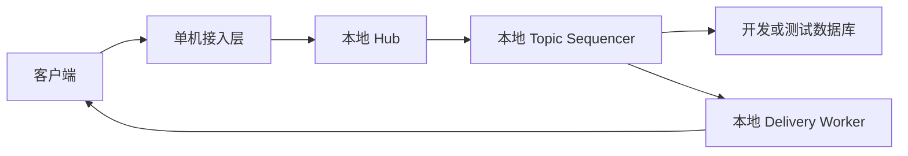

# IM 服务端开发单机版计划

> 文档信息
>
> - 更新日期：2026-07-29
> - 类型：实施记录
> - 当前使用方法：[开发单机版使用说明](../standalone.md)
> - 适用环境：`development`、`test`
> - 生产使用：禁止
> - 当前结论：计划内任务及完成定义已经闭环

状态定义：

| 标记 | 含义 |
| --- | --- |
| ✅ | 已实现并有自动化验证 |
| ⬜ | 尚未实现或尚未执行 |

## 1. 定位

开发单机版用于降低本地开发和自动化测试成本，只运行一个 IM 服务节点，不依赖集群成员发现、节点间 RPC、Topic Proxy、集群多数派或故障转移。

单机版与生产集群版使用同一套业务代码和同一个二进制文件，通过显式运行环境和部署模式区分，禁止维护两套业务实现。

适用场景：

- 本地功能开发。
- 单元测试和集成测试。
- API 联调与产品演示。
- 单节点性能基准。
- 故障定位和最小复现。

不适用场景：

- 正式业务流量。
- 高可用要求。
- 多节点容量扩展。
- 容灾、滚动升级和跨故障域部署。

## 2. 目标配置

当前使用独立配置文件 `configs/im.standalone.yaml`，并明确声明运行档位：

```yaml
runtime:
  environment: development
  deployment_mode: standalone

```

单机模板故意不提供 `cluster_config`。当前实现满足：

- `deployment_mode=standalone` 只允许与 `development` 或 `test` 组合。
- 单机模式不得初始化节点间监听器、集群连接池或 Topic Proxy。
- 如果 `environment=production`，配置校验必须在监听客户端端口前拒绝启动。
- 不允许通过遗漏 `cluster_config.self` 的方式隐式进入生产单机模式。

## 3. 目标架构



要求：

- Topic 解析始终返回本地 Owner。
- 消息不经过集群序列化、网络传输和代理队列。
- Topic 排序、幂等、存储、投递和历史同步逻辑与集群版复用。
- 单机专用代码仅限于 Resolver、Transport 和部署初始化，不复制业务处理代码。

## 4. 实施任务

| ID | 优先级 | 状态 | 任务 | 验收结果 |
| --- | --- | --- | --- | --- |
| STANDALONE-001 | P0 | ✅ | 增加显式运行环境和部署模式 | 不再通过空配置猜测运行档位 |
| STANDALONE-002 | P0 | ✅ | 增加生产环境禁止单机的启动校验 | 生产单机配置必定启动失败 |
| STANDALONE-003 | P1 | ✅ | 提供独立单机 YAML 示例 | 配置离线门禁、启动和调试说明已验证 |
| STANDALONE-004 | P1 | ✅ | 隔离本地 Resolver 和 Transport | 显式 standalone 在解析集群配置前返回，不创建集群运行时 |
| STANDALONE-005 | P1 | ✅ | 建立单机功能与性能回归 | 三协议建群、发布和幂等重试，以及连接、热点和数据库故障回归均已落地 |

### 4.0 已完成实现核对

| ID | 代码交付 | 验证 |
| --- | --- | --- |
| STANDALONE-003 | `configs/im.standalone.yaml` 不包含集群节点，提供 MySQL、本地媒体、认证、健康接口和安全边界；`docs/standalone.md` 提供初始化、启动和验证步骤 | `im-server --validate_config` 实际执行通过；配置解析测试通过 |
| STANDALONE-004 | `clusterInit` 接收显式 `deployment_mode`；standalone 在解析 `cluster_config` 前返回；运行指标增加 `RuntimeEnvironment` 和 `DeploymentMode` | 测试传入无效集群配置和非空节点身份，仍不创建 `Cluster`；本地 Resolver 始终返回本地 |
| STANDALONE-005 | `tests/standalone` 覆盖真实三协议、七类消息生命周期、热点 Topic、长连接、数据库韧性和崩溃恢复；`scripts/test-standalone-process.sh` 自动管理隔离 MySQL 与两轮服务进程 | 三协议语义一致；七类消息发布/历史/删除通过；64 路重连、256 条长连接、1600 次热点投递、分级数据库延迟、连接池耗尽、ACK 后 SIGKILL 恢复、数据库失联恢复及 SIGTERM 关闭全部通过 |

### 4.0.1 回归中修复的问题

- 用户初始化会同时创建 `me` 和 `fnd` 两个临时订阅；订阅计数校验现只限制持久化普通群和频道，示例数据库可完整初始化。
- `LiveSessions` 和 `TotalSessions` 在首个连接到达前注册，避免统计协程因未知变量导致进程崩溃。
- Long Polling 首次 `hi` 与 WebSocket、gRPC 统一返回 `201 created`。
- 数据库 `CheckDbVersion` 不再读取启动期缓存；MySQL、PostgreSQL、MongoDB 和 RethinkDB 都执行真实只读查询，Readiness 可以发现运行期失联。
- MySQL 主动版本查询保留“缺库/缺表即尚未初始化”的稳定错误语义，使全新隔离数据库仍可由 `init-db` 自动创建。
- MySQL 和 PostgreSQL 消息删除游标改用 Topic `name`、订阅 `userid` 更新，修复严格 SQL 模式下硬删除返回 500 和软删除游标无法更新。

### 4.1 显式部署模式

- 配置增加 `runtime.environment`。
- 配置增加 `runtime.deployment_mode`。
- 支持值使用常量和严格校验，不接受未知字符串。
- 启动日志记录运行环境和部署模式，但不得输出密钥。
- 指标暴露当前部署模式，方便发现错误部署。

### 4.2 单机快速启动

- 提供不包含集群地址的最小配置。
- 默认使用本地文件存储或开发对象存储配置。
- 提供数据库初始化和启动命令。
- 提供健康检查和示例客户端验证步骤。
- 配置中不得保存真实生产密钥。

### 4.3 性能优化

单机版继续实施与集群版共享的性能任务：

- 移除热路径消息正文日志。
- 修复数据库连接池初始化顺序。
- 广播消息按协议预序列化。
- 消除普通群逐成员离线 Presence 放大。
- 隔离 Push、插件、附件和游标更新等非核心副作用。
- 实现有序微批持久化。
- 配置化 Session、Topic 和后台任务队列。
- 对热点 Topic 的 Delivery 阶段进行分片。
- 为搜索字段建立数据库索引。

单机版不实施：

- 节点间 gRPC Lane。
- Ring 成员管理。
- Topic Owner 跨节点迁移。
- 多数派和脑裂处理。
- 节点 Drain 协调。

## 5. 测试矩阵

| 状态 | 场景 | 当前验证 |
| --- | --- | --- |
| ✅ | 启动与关闭 | 一键脚本自动创建隔离 MySQL、初始化数据库、构建并拉起两轮服务；最终 SIGTERM 在 20 秒内退出并写出完整关闭标记 |
| ✅ | WebSocket、Long Polling、gRPC | 三入口真实执行 hi、basic 登录、建群、文本发布及幂等重试，并对照状态码、文本和参数键 |
| ✅ | 文本、富文本和媒体消息 | 真实进程完成 text、drafty、image、video、voice、audio、file 的发布、正向历史读取、类型/seq 核对和物理删除 |
| ✅ | 普通群和广播频道 | ACL、离线成员管理、角色和频道只读回归已覆盖 |
| ✅ | 多端同步 | 已读、送达、输入状态、离线恢复相关业务测试已覆盖 |
| ✅ | 单热点群组 | 16 个真实 WebSocket 订阅者接收 100 条持久化消息，共 1600 次网络投递无丢失；另有 100/1000 订阅者本地 Fanout 基准 |
| ✅ | 大量空闲连接 | 256 个 WebSocket 保持 60 秒并跨过 49.5 秒 Ping 周期；Session 全部存活，测试窗口 GC=5、GC p99=45.333µs |
| ✅ | 慢客户端 | 有界 Session 队列满时只拒绝当前 Session 的测试已覆盖 |
| ✅ | 数据库延迟 | 真实 MySQL 10/50/200ms 分级查询、2 连接池耗尽后 150ms 上下文超时及释放恢复通过；完全失联时 readyz=503、恢复后=200 |
| ✅ | 非法生产单机配置 | 生产和预发布 standalone 在监听端口前被部署门禁拒绝 |

## 6. 验收标准

- ✅ `development + standalone` 和 `test + standalone` 通过部署模式校验。
- ✅ `production + standalone` 必须返回明确错误并退出。
- ✅ 单机启动不监听集群端口，也不创建集群 Goroutine 和队列。
- ✅ 已成功 ACK 的消息不会丢失：第一进程返回 ACK 后立即 SIGKILL，第二进程从同一数据库读回原消息，Client ID 重试返回原 seq。
- ✅ 同一 Topic 的 seq 单调递增，Client ID 重试不产生重复消息：业务测试和真实三协议幂等重试均通过。
- ✅ WebSocket、Long Polling 和 gRPC 的核心消息行为一致：进程级握手、登录、建群、发布和重试对照通过。
- ✅ 当前全部功能测试与单机核心数据竞争测试通过。
- ✅ 单机容量报告明确只作为开发和性能对比数据，不作为生产容量承诺。

## 7. 交付物

- ✅ `configs/im.standalone.yaml` 单机配置模板。
- ✅ `docs/standalone.md` 单机启动、初始化和调试说明。
- ✅ 单机功能回归测试：共享业务、race、三协议、七类消息、热点网络投递、长连接、数据库韧性和崩溃恢复已完成。
- ✅ `scripts/test-standalone-process.sh`：隔离数据库和真实服务进程的一键完整回归。
- ✅ `docs/standalone-capacity-baseline.md`：微基准、热点扇出、真实网络投递、连接/GC、重连、数据库延迟和故障恢复基线已记录。
- ✅ 生产环境禁止单机的自动化测试。

## 8. 完成定义

只有同时满足以下条件，开发单机版才算完成：

- 显式部署模式已经落地。
- 生产环境禁止单机的门禁已经生效。
- 单机配置和启动文档可重复执行。
- 单机不初始化任何集群资源。
- 共享业务测试全部通过。

单机版完成不代表系统达到生产可用标准；正式部署必须使用生产集群版。

## 9. 下一步执行顺序

1. ✅ STANDALONE-001、002：显式部署模式和生产禁止单机门禁。
2. ✅ STANDALONE-003：独立配置、初始化、启动和调试说明。
3. ✅ STANDALONE-004：显式 standalone 跳过全部集群运行时。
4. ✅ STANDALONE-005：共享功能、race、三协议、热点、连接、重连和数据库故障回归已完成。
5. ✅ 当前单机版计划已闭环。
6. 后续若需要容量承诺，应在固定 Linux 环境执行最大连接、持续消息吞吐、大消息矩阵和多小时稳定性测试；这些属于容量认证，不改变“生产必须集群”的约束。
